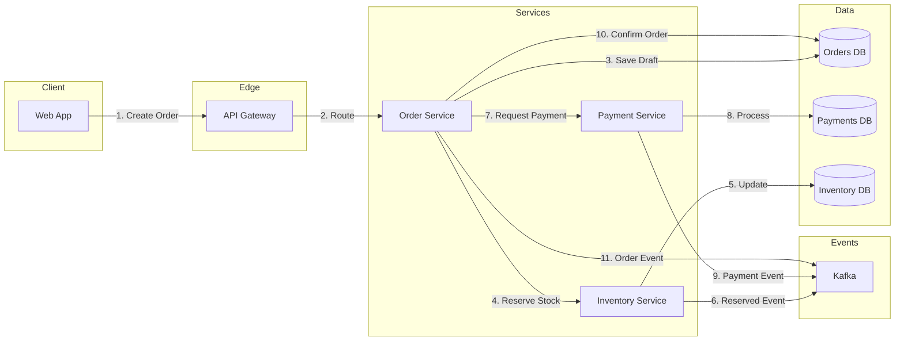
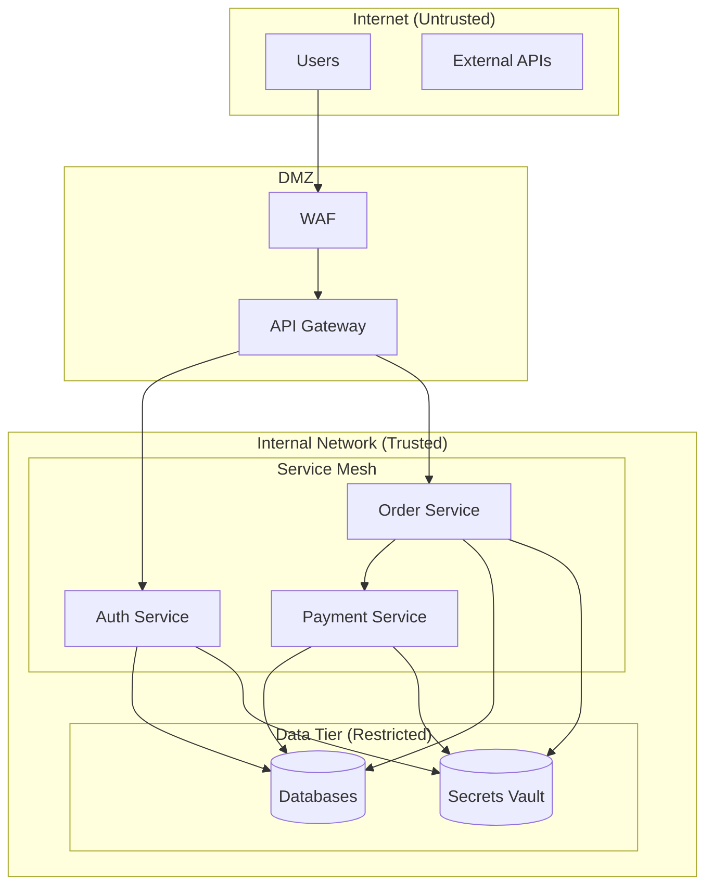

# Reference Architecture Playbook

> **Purpose**: Guide the creation of reference architectures that define system structure, component responsibilities, integration patterns, and quality attributes
> **Version**: 1.0
> **Last Updated**: 2024-12-31

---

## Mental Model

A reference architecture is the structural blueprint for a system. It answers "How do the pieces fit together?" before anyone writes code. Good architecture enables good implementation; bad architecture constrains it.

```
Requirements → Architecture → Technical Specs → Implementation
      ↓             ↓               ↓                ↓
   "What"      "Structure"      "Details"         "Code"
```

**Architecture Concerns:**
```
                    ┌─────────────────────────────────────┐
                    │           FUNCTIONAL               │
                    │   Components, Responsibilities,    │
                    │   Interfaces, Data Flows           │
                    └─────────────────────────────────────┘
                                    │
        ┌───────────────────────────┼───────────────────────────┐
        ▼                           ▼                           ▼
┌───────────────┐         ┌─────────────────┐         ┌─────────────────┐
│  OPERATIONAL  │         │    QUALITY      │         │   DEVELOPMENT   │
│ Deployment,   │         │  Performance,   │         │  Modularity,    │
│ Scaling, Ops  │         │  Security,      │         │  Testability,   │
│               │         │  Reliability    │         │  Maintainability│
└───────────────┘         └─────────────────┘         └─────────────────┘
```

**The Architecture Quality Ladder:**

| Level | State | Characteristics |
|-------|-------|-----------------|
| 0 | Napkin | Boxes and lines, no substance |
| 1 | Structural | Components identified, responsibilities vague |
| 2 | Connected | Interfaces defined, data flows unclear |
| 3 | Complete | All concerns addressed at high level |
| 4 | Robust | Failure modes, scaling, security explicit |
| 5 | Validated | Reviewed, tested against requirements |

**Target: Level 4-5 before moving to technical specifications.**

---

## Inputs / Outputs

### Inputs
- **PRD/FRD**: Functional requirements to satisfy
- **Non-Functional Requirements**: Performance, security, scale targets
- **Constraints**: Technology mandates, budget, timeline, team skills
- **Existing Systems**: Integration points, migration considerations
- **Standards**: Organizational patterns, compliance requirements

### Outputs
- **Architecture Document**: Complete structural blueprint
- **Component Catalog**: What exists and what each does
- **Interface Contracts**: How components communicate
- **Data Flow Diagrams**: Where data moves and transforms
- **Decision Records**: Why this architecture (ADRs)
- **Risk Assessment**: Architectural risks and mitigations

---

## Evaluation Dimensions

### Dimension 1: Component Responsibilities
Every component must have a clear, singular responsibility. Ambiguous responsibilities lead to tangled implementations.

**Probing Questions:**
- What components exist in this architecture?
- What is each component's single responsibility?
- Are there overlapping responsibilities?
- Could any component be split or merged?
- What does each component own (data, logic, state)?

**Red Flags:**
- Component does "everything related to X"
- Multiple components share same responsibility
- Component responsibility described vaguely
- "Miscellaneous" or "utilities" component

**Good Example:**
```
## Component Catalog

### Authentication Service
**Responsibility:** Verify user identity and issue access tokens
**Owns:** User credentials, sessions, tokens
**Does NOT:** User profile management, authorization rules

### Authorization Service  
**Responsibility:** Evaluate access permissions for resources
**Owns:** Roles, permissions, policies
**Does NOT:** Identity verification, user management

### User Service
**Responsibility:** Manage user profiles and preferences
**Owns:** User profiles, preferences, settings
**Does NOT:** Authentication, session management
```

**Bad Example:**
```
### User Service
Handles all user-related functionality including login, profiles, 
permissions, and user data.
```

---

### Dimension 2: Integration Contracts
How components communicate must be precisely defined. Vague integrations cause integration failures.

**Probing Questions:**
- How does each component communicate with others?
- What protocols are used? (REST, gRPC, events, queues)
- What's the contract for each integration point?
- Are integrations synchronous or asynchronous?
- How are contracts versioned?

**Red Flags:**
- "Component A talks to Component B" (how?)
- No protocol specified
- No contract definition
- Missing error handling in integration

**Good Example:**
```
## Integration Patterns

### API Gateway → Authentication Service
- **Protocol:** REST/HTTPS
- **Contract:** OpenAPI 3.0 (see /specs/auth-api.yaml)
- **Auth:** mTLS between services
- **Timeout:** 5s with 2 retries
- **Circuit Breaker:** Open after 5 failures in 30s

### Order Service → Inventory Service
- **Protocol:** Async via RabbitMQ
- **Pattern:** Request-Reply
- **Queue:** inventory.check.request / inventory.check.response
- **Message Format:** 
  ```json
  {
    "correlationId": "uuid",
    "items": [{"sku": "string", "quantity": "int"}]
  }
  ```
- **SLA:** Response within 500ms (p95)
- **Failure:** Dead letter queue after 3 retries

### Event Bus (Domain Events)
- **Protocol:** Kafka
- **Topics:** orders.created, payments.completed, inventory.reserved
- **Schema Registry:** Confluent, Avro schemas
- **Retention:** 7 days
- **Consumers:** At-least-once delivery, idempotent handlers
```

**Bad Example:**
```
Services communicate via APIs and message queues as needed.
```

---

### Dimension 3: Data Flow
Where does data originate, move, transform, and rest? Unclear data flows cause data inconsistencies and performance issues.

**Probing Questions:**
- What is the source of truth for each data entity?
- How does data flow through the system?
- Where does data transform?
- What's the data latency at each step?
- How is data consistency maintained?

**Red Flags:**
- Multiple sources of truth
- Undefined data ownership
- No latency expectations
- Unclear consistency model

**Good Example:**
```
## Data Flow: Order Processing



**Data Ownership:**
| Entity | Owner | Source of Truth | Sync Pattern |
|--------|-------|-----------------|--------------|
| Order | Order Service | Orders DB | Event-driven to analytics |
| Payment | Payment Service | Payments DB | Sync callback to Order |
| Inventory | Inventory Service | Inventory DB | Saga with compensation |

**Consistency Model:**
- Order creation: Saga pattern with compensating transactions
- Inventory: Pessimistic reservation, release on timeout
- Payment: At-most-once with idempotency keys
```

**Bad Example:**
```
Data flows between services as needed.
```

---

### Dimension 4: Failure Modes
Systems fail. Architecture must define what happens when components fail. Missing failure handling causes cascading outages.

**Probing Questions:**
- What happens when each component fails?
- What are the dependencies and their criticality?
- How does the system degrade gracefully?
- What's the blast radius of each failure?
- How is failure detected and recovered?

**Red Flags:**
- No failure scenarios documented
- "Service will be highly available"
- No graceful degradation plan
- Single points of failure unaddressed

**Good Example:**
```
## Failure Modes

### Authentication Service Down
- **Detection:** Health check fails (10s interval)
- **Impact:** New logins blocked, existing sessions continue
- **Degradation:** 
  - Cache valid tokens (30 min TTL)
  - Serve cached auth decisions
  - Queue new login attempts
- **Blast Radius:** Login flow only, authenticated users unaffected
- **Recovery:** Automatic restart, circuit breaker reset after 3 successes

### Payment Gateway Timeout
- **Detection:** Response >5s or connection error
- **Impact:** Checkout blocked
- **Degradation:**
  - Retry with exponential backoff (1s, 2s, 4s)
  - Failover to secondary gateway
  - If all fail: Save order as PENDING_PAYMENT, notify user
- **Blast Radius:** New orders only, existing orders unaffected
- **Recovery:** User retries payment, or async payment confirmation

### Database Failover
- **Detection:** Connection errors, replication lag >30s
- **Impact:** Writes blocked during failover (~30s)
- **Degradation:**
  - Read replicas continue serving reads
  - Writes queued in application (memory-limited)
- **Blast Radius:** All services using primary
- **Recovery:** Automatic failover to replica, promote to primary

### Kafka Broker Loss
- **Detection:** Consumer lag alerts, producer errors
- **Impact:** Event processing delayed
- **Degradation:**
  - Partition redistribution (automatic)
  - Producers retry with backoff
- **Blast Radius:** Event-driven workflows delayed
- **Recovery:** Broker restart, catch-up from replication
```

**Bad Example:**
```
The system will handle failures appropriately.
```

---

### Dimension 5: Scalability Assumptions
What load is this designed for? How does it scale? Unspecified scalability leads to performance surprises.

**Probing Questions:**
- What's the expected load (users, requests, data volume)?
- What's the growth projection?
- How does each component scale?
- What are the bottlenecks?
- What's the scaling trigger and mechanism?

**Red Flags:**
- No load estimates
- "Scales horizontally" without specifics
- Stateful components without scaling strategy
- No bottleneck analysis

**Good Example:**
```
## Scalability Model

### Current Load (Baseline)
- Users: 10,000 DAU
- Peak requests: 500/sec
- Database: 50GB, 1000 writes/sec
- Events: 10,000/minute

### Target Load (12 months)
- Users: 100,000 DAU (10x)
- Peak requests: 5,000/sec
- Database: 500GB, 10,000 writes/sec
- Events: 100,000/minute

### Scaling Strategy

| Component | Scaling Type | Trigger | Mechanism |
|-----------|--------------|---------|-----------|
| API Gateway | Horizontal | CPU >70% | Auto-scale group (2-20 instances) |
| Auth Service | Horizontal | Requests >1000/s/instance | K8s HPA |
| Order Service | Horizontal | CPU >60% | K8s HPA (3-30 pods) |
| Orders DB | Vertical + Read replicas | Connections >80% | Add replicas |
| Kafka | Partition scaling | Lag >10s | Add partitions |
| Redis Cache | Cluster mode | Memory >70% | Add shards |

### Bottleneck Analysis
| Bottleneck | Limit | Mitigation |
|------------|-------|------------|
| Database writes | 10k/sec | Sharding by customer_id |
| Payment gateway | 100 TPS | Queue + rate limit |
| Auth token generation | 5k/sec | Pre-generated token pool |

### Stateful Components
- **Redis sessions:** Cluster mode, 6 nodes, failover automatic
- **Database:** Primary + 2 read replicas, failover <30s
- **File storage:** S3, virtually unlimited
```

**Bad Example:**
```
The system scales to meet demand.
```

---

### Dimension 6: Security Boundaries
Where are the trust boundaries? What's protected from what? Security as an afterthought becomes security as a vulnerability.

**Probing Questions:**
- What are the trust boundaries?
- How is authentication handled at each boundary?
- How is authorization enforced?
- What data is sensitive and how is it protected?
- What are the attack surfaces?

**Red Flags:**
- No trust boundaries defined
- "Internal services don't need auth"
- Sensitive data not classified
- No encryption strategy

**Good Example:**
```
## Security Architecture

### Trust Boundaries



### Authentication
| Boundary | Method | Details |
|----------|--------|---------|
| Internet → DMZ | TLS 1.3 | Certificate pinning on mobile |
| DMZ → Services | JWT + mTLS | Gateway validates, services verify |
| Service → Service | mTLS | Istio service mesh |
| Service → Database | IAM + TLS | Connection pooling, short-lived creds |

### Authorization
| Level | Method | Enforcement |
|-------|--------|-------------|
| API | OAuth 2.0 scopes | Gateway |
| Resource | RBAC | Service layer |
| Data | Row-level security | Database |

### Data Classification
| Classification | Examples | Protection |
|----------------|----------|------------|
| Public | Product catalog | None required |
| Internal | Order history | Authentication required |
| Confidential | Payment details | Encryption at rest + in transit |
| Restricted | Credentials, PII | Vault storage, audit logging |

### Encryption
- **In Transit:** TLS 1.3 everywhere
- **At Rest:** AES-256 for databases, S3
- **Secrets:** HashiCorp Vault, automatic rotation
- **PII:** Field-level encryption, tokenization for payments
```

**Bad Example:**
```
The system uses standard security practices.
```

---

## Extended Question Bank

### Component Design
1. List every component—what's missing?
2. For each component: what's its single responsibility?
3. What would happen if you removed this component?
4. Are there hidden components (caches, queues, proxies)?
5. What's the deployment unit for each component?

### Integration
6. Draw every integration—are any missing?
7. For each integration: sync or async? Why?
8. What's the contract for each integration?
9. How do you version contracts?
10. What happens when a contract changes?

### Data
11. What's the source of truth for each entity?
12. Draw the data flow for the critical path
13. What's the consistency model?
14. How is data replicated/synchronized?
15. What's the data retention policy?

### Failure
16. What if each component is completely down?
17. What if a component is slow but not down?
18. What's the worst-case cascading failure?
19. How long to detect each failure type?
20. What's the recovery procedure for each failure?

### Scale
21. What's the expected load in 6 months? 2 years?
22. What's the first bottleneck you'll hit?
23. How does each stateful component scale?
24. What's the cost model for scaling?
25. What load testing validates the architecture?

### Security
26. Draw the trust boundaries
27. What's the most valuable data to an attacker?
28. What's the attack surface?
29. How do you detect a breach?
30. What compliance requirements apply?

---

## Common Pitfalls

| Pitfall | Symptom | Fix |
|---------|---------|-----|
| **Box-and-line syndrome** | Pretty diagram, no substance | Add responsibilities, contracts, failure modes |
| **Single point of failure** | One component brings down system | Add redundancy, failover paths |
| **Security afterthought** | "We'll secure it later" | Security boundaries in initial design |
| **Optimistic scaling** | "It'll scale when needed" | Define scaling strategy per component |
| **Missing failure modes** | Production outages | Document every failure scenario |
| **Vague integrations** | "Services communicate" | Protocol, contract, error handling |
| **Ignored latency** | Slow system | Define latency budget per path |
| **Monolith in disguise** | Distributed monolith | Clear boundaries, isolated data |
| **Over-engineering** | Complexity without need | Start simple, document growth path |
| **Under-specified** | Ambiguity in implementation | Detailed enough for tech specs |

---

## Architecture Document Template

```markdown
# Reference Architecture: [System Name]

> **Owner:** [Name]
> **Status:** [Draft | Review | Approved]
> **Version:** [X.X]
> **Last Updated:** [YYYY-MM-DD]

---

## Overview

**Purpose:** [What this system does]
**Scope:** [Boundaries of this architecture]
**Key Drivers:** [Primary requirements driving decisions]

---

## Architecture Principles

1. [Principle 1]: [Rationale]
2. [Principle 2]: [Rationale]

---

## System Context

```mermaid
C4Context
    [Context diagram showing system boundaries]
```

**External Systems:**
| System | Integration | Purpose |
|--------|-------------|---------|
| [System] | [Protocol] | [Why] |

---

## Component Architecture

```mermaid
C4Container
    [Container diagram showing components]
```

### Component Catalog

#### [Component Name]
- **Responsibility:** [Single responsibility]
- **Owns:** [Data, state, logic]
- **Technology:** [Stack]
- **Scaling:** [Strategy]

[Repeat for each component]

---

## Integration Architecture

### Integration Map

```mermaid
flowchart
    [Integration diagram]
```

### Integration Contracts

#### [Component A] → [Component B]
- **Protocol:** [REST/gRPC/Async]
- **Contract:** [Link or inline]
- **Auth:** [Method]
- **Error Handling:** [Strategy]

---

## Data Architecture

### Data Flow

```mermaid
flowchart
    [Data flow diagram]
```

### Data Ownership

| Entity | Owner | Storage | Consistency |
|--------|-------|---------|-------------|
| [Entity] | [Service] | [DB] | [Model] |

---

## Failure Modes

| Failure | Detection | Impact | Degradation | Recovery |
|---------|-----------|--------|-------------|----------|
| [Failure] | [How] | [What] | [Graceful] | [Steps] |

---

## Scalability

### Load Model
| Metric | Current | Target (12mo) |
|--------|---------|---------------|
| [Metric] | [Value] | [Value] |

### Scaling Strategy
| Component | Type | Trigger | Mechanism |
|-----------|------|---------|-----------|
| [Component] | [H/V] | [When] | [How] |

---

## Security Architecture

### Trust Boundaries

```mermaid
flowchart
    [Trust boundary diagram]
```

### Security Controls
| Control | Implementation |
|---------|----------------|
| Authentication | [Method] |
| Authorization | [Method] |
| Encryption | [Method] |

---

## Technology Stack

| Layer | Technology | Rationale |
|-------|------------|-----------|
| [Layer] | [Tech] | [Why] |

---

## Architecture Decision Records

| ADR | Decision | Status |
|-----|----------|--------|
| [ADR-001] | [Decision] | Approved |

---

## Risks

| Risk | Likelihood | Impact | Mitigation |
|------|------------|--------|------------|
| [Risk] | H/M/L | H/M/L | [Action] |

---

## Open Questions

- [ ] [Question]

---

## Changelog

| Version | Date | Author | Changes |
|---------|------|--------|---------|
| X.X | YYYY-MM-DD | [Name] | [Changes] |
```

---

## Invariants

1. **Every component MUST have a single, clear responsibility** — no "handles X and also Y"
2. **Every integration MUST have a defined contract** — protocol, format, error handling
3. **Failure modes MUST be documented** — what happens when things break
4. **Security MUST be designed in, not added on** — trust boundaries from day one
5. **Scalability targets MUST be stated** — "scales" is not a strategy
6. **Data ownership MUST be explicit** — one source of truth per entity
7. **Technology choices MUST be justified** — ADRs for significant decisions
8. **Architecture MUST satisfy requirements** — trace back to PRD/FRD

---

## Artifact Lineage

```
    PRD
     ↓
    FRD
     ↓
Reference Architecture  ← (You are here)
     ↓
Technical Specs
     ↓
Implementation Plan
```

**Handoff to Tech Spec:**
- Component responsibilities clear
- Integration contracts defined
- Data flows documented
- Failure modes addressed
- Ready for implementation detail

---

## Version History

| Version | Date | Changes |
|---------|------|---------|
| 1.0 | 2024-12-31 | Initial playbook: 6 dimensions, 30-question bank, template, invariants |

---

*Systems Architect — Designing structures that enable success and prevent failure.*
