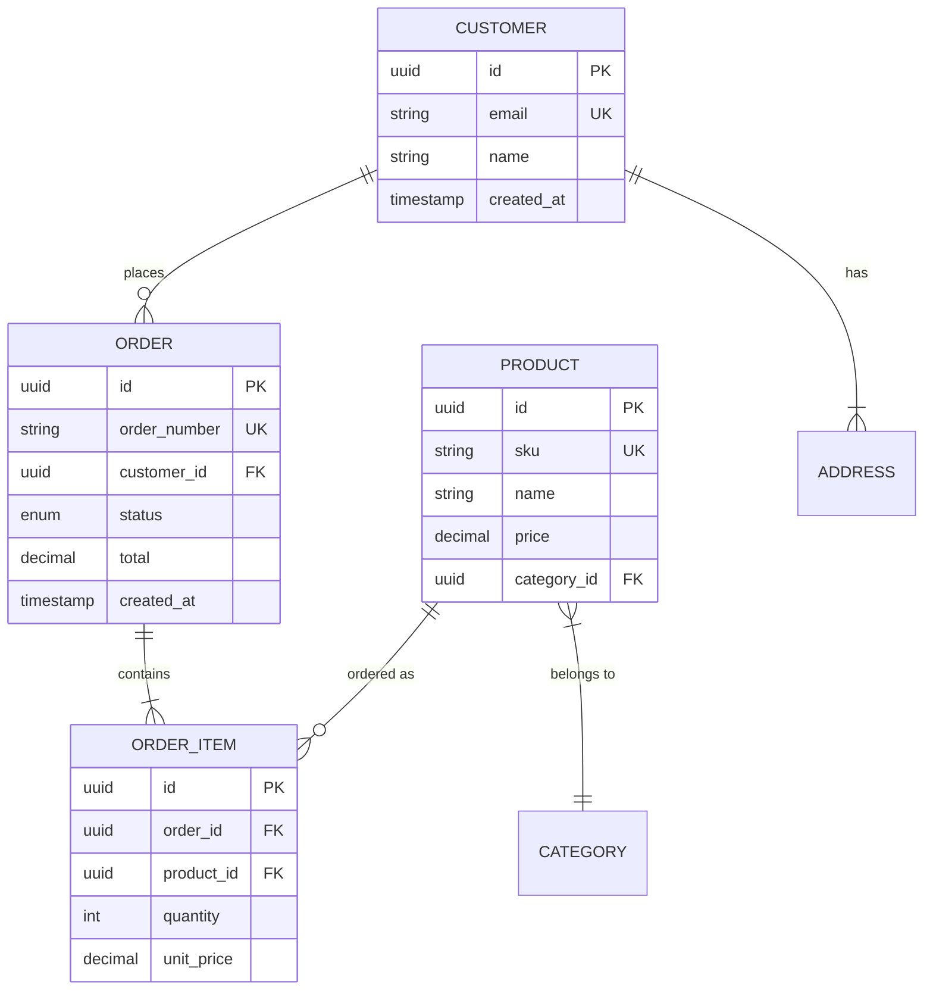

# ERD (Entity-Relationship Diagram) Playbook

> **Purpose**: Guide the creation of entity-relationship diagrams that accurately model domain data, relationships, and constraints
> **Version**: 1.0
> **Last Updated**: 2024-12-31

---

## Mental Model

An ERD is the blueprint for your data. It answers "What things exist, how do they relate, and what rules govern them?" before you write a single CREATE TABLE statement.

```
Domain Concepts → Entities → Relationships → Constraints → Schema
       ↓             ↓            ↓              ↓           ↓
   "Things"      "Tables"    "How linked"    "Rules"     "DDL"
```

**The Data Modeling Hierarchy:**
```
Conceptual Model (Business concepts, no technical detail)
        ↓
Logical Model (ERD - Entities, relationships, attributes)  ← This playbook
        ↓
Physical Model (Tables, indexes, partitions, types)
```

**The ERD Quality Ladder:**

| Level | State | Characteristics |
|-------|-------|-----------------|
| 0 | Napkin | Boxes with names, no detail |
| 1 | Sketched | Entities exist, relationships vague |
| 2 | Connected | Relationships defined, cardinality missing |
| 3 | Structured | Cardinality explicit, keys undefined |
| 4 | Complete | Keys, constraints, nullability defined |
| 5 | Validated | Query patterns verified, ready for physical model |

**Target: Level 4-5 before generating physical schema.**

---

## Inputs / Outputs

### Inputs
- **PRD/FRD**: Business requirements, functional behaviors
- **Domain Knowledge**: Business rules, terminology, workflows
- **Query Patterns**: How data will be accessed (critical for design)
- **Volume Estimates**: Expected data sizes and growth
- **Existing Systems**: Data that already exists

### Outputs
- **ERD Diagram**: Visual representation of entities and relationships
- **Entity Catalog**: Detailed attribute definitions
- **Relationship Matrix**: All relationships with cardinality and constraints
- **Data Dictionary**: Terminology definitions
- **Constraint Documentation**: Business rules encoded in the model

---

## Evaluation Dimensions

### Dimension 1: Entity Completeness
Every domain concept that needs to be stored should be represented. Missing entities cause schema rewrites.

**Probing Questions:**
- What are ALL the "things" in this domain?
- What nouns appear repeatedly in requirements?
- What would you need to report on?
- What has identity (needs an ID)?
- Are there implicit entities hiding in attributes?

**Red Flags:**
- Entities with many unrelated attributes (god entity)
- Repeated data groups that should be separate entities
- Entities that are really attributes
- Missing lookup/reference tables

**Good Example:**
```
## Entities Identified

### Core Business Entities
- **Customer** - Person or organization that places orders
- **Order** - A purchase transaction
- **OrderItem** - Line item within an order
- **Product** - Item available for sale
- **ProductCategory** - Classification of products

### Supporting Entities
- **Address** - Physical location (billing, shipping)
- **PaymentMethod** - How customer pays
- **Shipment** - Physical delivery of items

### Reference/Lookup Entities
- **OrderStatus** - Enum: DRAFT, PENDING, PAID, SHIPPED, DELIVERED
- **Country** - ISO country codes
- **Currency** - ISO currency codes
```

**Bad Example:**
```
## Entities
- Customer
- Order
- Product
```

---

### Dimension 2: Relationship Cardinality
Every relationship must have explicit cardinality. Ambiguous cardinality causes join bugs and data integrity issues.

**Probing Questions:**
- For each relationship: one-to-one, one-to-many, or many-to-many?
- Can the "one" side ever be zero? (0..1 vs 1)
- Can the "many" side ever be zero? (0..* vs 1..*)
- What happens to the relationship over time?
- Are there relationships that should exist but don't?

**Red Flags:**
- "Related to" without cardinality
- Assumed cardinality (everyone "knows" it's one-to-many)
- Missing many-to-many junction tables
- Optional vs required not specified

**Cardinality Notation:**
```
1     = Exactly one (required)
0..1  = Zero or one (optional)
*     = Zero or more
1..*  = One or more (required, multiple)
```

**Good Example:**
```
## Relationships

| Entity A | Relationship | Entity B | Cardinality | Notes |
|----------|--------------|----------|-------------|-------|
| Customer | places | Order | 1 : 0..* | Customer can have no orders (new customer) |
| Order | contains | OrderItem | 1 : 1..* | Order must have at least one item |
| OrderItem | references | Product | * : 1 | Many items can reference same product |
| Product | belongs to | ProductCategory | * : 1 | Every product must have a category |
| Customer | has | Address | 1 : 1..* | Customer needs at least billing address |
| Order | shipped via | Shipment | 1 : 0..1 | Order may not yet have shipment |

### Many-to-Many Relationships
| Entity A | Junction | Entity B | Notes |
|----------|----------|----------|-------|
| Product | ProductTag | Tag | Product can have multiple tags |
| Customer | CustomerRole | Role | Customer can have multiple roles |
```

**Bad Example:**
```
Customer -- Order (has many)
Order -- Product (contains)
```

---

### Dimension 3: Key Strategy
Every entity needs a clear key strategy. Poor key design causes performance and maintenance nightmares.

**Probing Questions:**
- What uniquely identifies each entity?
- Natural key or surrogate key? Why?
- What's the primary key type? (int, bigint, UUID)
- Are there alternate keys (unique constraints)?
- What's the foreign key strategy?

**Red Flags:**
- Composite keys everywhere (complexity)
- Natural keys that can change
- Inconsistent key types
- No unique constraints beyond PK

**Good Example:**
```
## Key Strategy

### Primary Key Convention
- All entities use surrogate keys (UUID)
- Reason: Natural keys can change, UUIDs are portable, avoid integer exhaustion
- Type: `UUID` (PostgreSQL native, 16 bytes)

### Entity Keys

| Entity | Primary Key | Natural Key / Alternate | Notes |
|--------|-------------|------------------------|-------|
| Customer | id (UUID) | email (UNIQUE) | Email can change, so not PK |
| Order | id (UUID) | order_number (UNIQUE) | Human-readable identifier |
| Product | id (UUID) | sku (UNIQUE) | SKU is business identifier |
| OrderItem | id (UUID) | (order_id, product_id, sequence) | Compound natural key as alternate |

### Foreign Key Conventions
- All FKs named: `{referenced_entity}_id`
- All FKs indexed (unless single-row lookup)
- ON DELETE behavior explicit (see Dimension 5)

### Composite Keys (Where Used)
- **ProductTag:** (product_id, tag_id) - Junction table, composite PK
- **CustomerAddress:** (customer_id, address_type) - Alternate unique constraint
```

**Bad Example:**
```
All tables have an `id` column as primary key.
```

---

### Dimension 4: Normalization Rationale
Normalization level should be intentional. Over-normalization causes join complexity; under-normalization causes update anomalies.

**Probing Questions:**
- What normalization form is each entity in?
- Where did you denormalize? Why?
- What update anomalies could occur?
- Are there derived/calculated fields? Why stored?
- What's the tradeoff between read and write performance?

**Red Flags:**
- Repeating groups (1NF violation)
- Partial dependencies (2NF violation)
- Transitive dependencies (3NF violation)
- Denormalization without documented reason

**Normalization Quick Reference:**
```
1NF: No repeating groups, atomic values
2NF: 1NF + no partial dependencies (all non-key attributes depend on full key)
3NF: 2NF + no transitive dependencies (non-key attributes don't depend on other non-key)
BCNF: 3NF + every determinant is a candidate key
```

**Good Example:**
```
## Normalization Analysis

### Target: 3NF with intentional denormalization

| Entity | Normal Form | Violations | Rationale |
|--------|-------------|------------|-----------|
| Customer | 3NF | None | Clean entity |
| Order | 3NF with denorm | customer_name stored | Avoid join on every order list |
| OrderItem | 3NF with denorm | product_name, unit_price stored | Historical accuracy - price at time of order |
| Product | 3NF | None | Clean entity |
| Address | 3NF | None | Clean entity |

### Denormalization Decisions

**Order.customer_name (denormalized)**
- Source: Customer.name
- Reason: Order listings need name; avoids N+1 or join on every query
- Sync strategy: Update on Customer.name change (event-driven)
- Risk: Stale if sync fails
- Mitigation: Nightly reconciliation job

**OrderItem.unit_price (intentional duplication)**
- Source: Product.price at time of order
- Reason: Price is a point-in-time fact; product price changes
- Not denormalization: This is correct modeling of historical data
```

**Bad Example:**
```
Tables are normalized appropriately.
```

---

### Dimension 5: Cascade/Orphan Behavior
What happens when parent data changes or is deleted? Undefined cascade behavior causes orphans or unexpected deletions.

**Probing Questions:**
- For each FK: what happens on parent delete?
- For each FK: what happens on parent update?
- Can child records exist without parents (orphans)?
- What's the soft delete vs hard delete strategy?
- How do you handle historical references?

**Cascade Options:**
```
CASCADE    - Delete/update children with parent
RESTRICT   - Prevent parent delete/update if children exist
SET NULL   - Set FK to NULL when parent deleted
SET DEFAULT - Set FK to default when parent deleted
NO ACTION  - Like RESTRICT, but checked at transaction end
```

**Red Flags:**
- No ON DELETE specified (database default varies)
- CASCADE on everything (dangerous)
- SET NULL creating orphan logic problems
- Soft delete without query filtering

**Good Example:**
```
## Referential Integrity Rules

### Delete Behavior

| Parent | Child | ON DELETE | Rationale |
|--------|-------|-----------|-----------|
| Customer | Order | RESTRICT | Don't delete customers with order history |
| Order | OrderItem | CASCADE | Order items don't exist without order |
| Product | OrderItem | RESTRICT | Can't delete product with order history |
| ProductCategory | Product | RESTRICT | Must reassign products first |
| Customer | Address | CASCADE | Addresses are owned by customer |

### Update Behavior

| Parent | Child | ON UPDATE | Rationale |
|--------|-------|-----------|-----------|
| All PKs | All FKs | CASCADE | PKs shouldn't change, but cascade if they do |

### Soft Delete Strategy

**Entities with soft delete:**
- Customer (has GDPR implications, need history)
- Product (need order history)
- Order (need history, auditing)

**Implementation:**
- Column: `deleted_at TIMESTAMP NULL`
- NULL = active, non-NULL = deleted
- All queries must filter: `WHERE deleted_at IS NULL`
- Unique constraints must include `deleted_at` or use partial index

**Entities with hard delete:**
- Cart items (ephemeral)
- Sessions (ephemeral)
- Temporary tokens

### Orphan Prevention

| Scenario | Risk | Mitigation |
|----------|------|------------|
| Customer deleted with orders | Orphaned orders | RESTRICT + soft delete |
| Product deleted with cart items | Orphaned cart | CASCADE (cart is ephemeral) |
| Category deleted with products | Orphaned products | RESTRICT, require reassignment |
```

**Bad Example:**
```
Deletes will be handled appropriately.
```

---

### Dimension 6: Index Implications
ERD design directly affects query performance. Design with query patterns in mind.

**Probing Questions:**
- What are the most common queries against each entity?
- What columns appear in WHERE clauses?
- What columns appear in JOIN conditions?
- What columns appear in ORDER BY?
- What composite indexes are needed?

**Red Flags:**
- No query patterns considered
- Obvious indexes missing
- Too many indexes (write overhead)
- Covering indexes not considered

**Good Example:**
```
## Query Patterns & Index Strategy

### Order Entity - Query Patterns

| Query | Frequency | Columns Used |
|-------|-----------|--------------|
| Orders by customer | Very high | customer_id |
| Recent orders | High | created_at DESC |
| Orders by status | High | status |
| Order by number | Medium | order_number |
| Orders by date range | Medium | created_at, customer_id |

### Recommended Indexes - Order

| Index | Columns | Type | Rationale |
|-------|---------|------|-----------|
| pk_orders | id | PK/UNIQUE | Primary key |
| idx_order_number | order_number | UNIQUE | Lookup by human identifier |
| idx_order_customer | customer_id | BTREE | FK, frequent filter |
| idx_order_status | status | BTREE | Filter by status |
| idx_order_created | created_at DESC | BTREE | Recent orders sort |
| idx_order_customer_created | (customer_id, created_at DESC) | BTREE | Customer's recent orders |

### Index Strategy Notes

**Foreign Keys:** All FKs indexed by default
**Composite indexes:** Column order matters—most selective first, or match query order
**Partial indexes:** Consider for soft delete: `WHERE deleted_at IS NULL`
**Covering indexes:** For read-heavy paths, include frequently selected columns

### Anti-Patterns Avoided
- No index on `status` alone (low cardinality) — but included for filtered counts
- No index on boolean flags — use partial index instead
- Avoid indexes on columns that are always updated together
```

**Bad Example:**
```
Indexes will be added as needed for performance.
```

---

## Extended Question Bank

### Entity Discovery
1. List every noun in the requirements—which are entities?
2. What reports need to be generated? What data do they need?
3. What attributes are really entities in disguise?
4. What lookup/reference data is needed?
5. What's the lifecycle of each entity?

### Relationships
6. For each entity pair: is there a relationship?
7. What's the cardinality—can you give real examples?
8. Are there implicit many-to-many relationships?
9. Can relationships change over time?
10. Are there self-referential relationships?

### Keys
11. What naturally identifies each entity?
12. Can that natural identifier change?
13. What's the key generation strategy?
14. Are there alternate unique constraints?
15. What's the FK naming convention?

### Normalization
16. Is there any repeated data?
17. Can any attribute be derived from others?
18. What would happen if parent data changes?
19. Where is denormalization justified?
20. What's the write vs read tradeoff?

### Integrity
21. What happens when each entity is deleted?
22. Can children exist without parents?
23. Soft delete or hard delete?
24. How do you handle historical references?
25. What cross-entity rules exist?

### Performance
26. What are the top 10 queries?
27. What's in WHERE clauses?
28. What's the expected data volume?
29. What indexes are obvious?
30. What queries might need optimization?

---

## Common Pitfalls

| Pitfall | Symptom | Fix |
|---------|---------|-----|
| **Missing entities** | Attributes that should be tables | Look for repeating groups, multi-value attributes |
| **Wrong cardinality** | Join returns wrong rows | Validate with real examples |
| **God entity** | Table with 50+ columns | Split by cohesion, lifecycle |
| **Implicit relationships** | No FK, just matching values | Make relationships explicit |
| **Natural key as PK** | Can't update business identifiers | Use surrogate key, natural as alternate |
| **Over-normalization** | Joins everywhere, slow reads | Strategic denormalization |
| **Under-normalization** | Update anomalies | Apply 3NF, document exceptions |
| **Undefined cascades** | Orphan data or unexpected deletes | Explicit ON DELETE for every FK |
| **No index planning** | Slow queries | Design with queries in mind |
| **Enum as string** | Inconsistent data | Use lookup table or database enum |

---

## ERD Template

```markdown
# ERD: [Domain/System Name]

> **Owner:** [Name]
> **Status:** [Draft | Review | Approved]
> **Version:** [X.X]
> **Last Updated:** [YYYY-MM-DD]

---

## Overview

**Domain:** [What this data model represents]
**Scope:** [What's included/excluded]
**Database:** [Target database system]

---

## Entity-Relationship Diagram



---

## Entity Catalog

### [Entity Name]

**Description:** [What this entity represents]
**Lifecycle:** [Created when, updated when, deleted when]

| Attribute | Type | Nullable | Default | Constraints | Description |
|-----------|------|----------|---------|-------------|-------------|
| id | UUID | No | gen_random_uuid() | PK | Primary key |
| [attr] | [type] | [Yes/No] | [default] | [constraints] | [description] |

**Business Rules:**
- [Rule 1]
- [Rule 2]

[Repeat for each entity]

---

## Relationship Matrix

| Parent | Child | Cardinality | ON DELETE | ON UPDATE | Notes |
|--------|-------|-------------|-----------|-----------|-------|
| [Entity] | [Entity] | [1:*, etc] | [CASCADE/RESTRICT] | [CASCADE] | [Notes] |

---

## Key Strategy

### Primary Keys
[PK strategy and conventions]

### Alternate Keys / Unique Constraints
| Entity | Columns | Notes |
|--------|---------|-------|
| [Entity] | [columns] | [notes] |

### Foreign Keys
[FK conventions]

---

## Normalization Notes

| Entity | Normal Form | Denormalization | Rationale |
|--------|-------------|-----------------|-----------|
| [Entity] | [1NF-BCNF] | [What] | [Why] |

---

## Index Strategy

### [Entity Name]
| Index | Columns | Type | Rationale |
|-------|---------|------|-----------|
| [name] | [columns] | [type] | [why] |

---

## Data Dictionary

| Term | Definition |
|------|------------|
| [Term] | [Definition] |

---

## Volume Estimates

| Entity | Initial | 1 Year | 3 Year | Growth Pattern |
|--------|---------|--------|--------|----------------|
| [Entity] | [rows] | [rows] | [rows] | [linear/exponential] |

---

## Open Questions

- [ ] [Question]

---

## Changelog

| Version | Date | Author | Changes |
|---------|------|--------|---------|
```

---

## ERD Notation Reference

### Mermaid ERD Cardinality
```
||--||  One to one (both required)
||--o|  One to zero-or-one
||--|{  One to one-or-more
||--o{  One to zero-or-more
}|--|{  Many to many (use junction table instead)
```

### Crow's Foot Notation
```
──────   One (required)
──────○  Zero or one (optional)
──────<  Many (required)
──────○< Many (optional)
```

---

## Invariants

1. **Every entity MUST have a primary key** — UUID or appropriate surrogate
2. **Every relationship MUST have explicit cardinality** — no "relates to"
3. **Every FK MUST have ON DELETE behavior specified** — no database defaults
4. **Denormalization MUST be documented and justified** — not accidental
5. **Key attributes MUST be non-nullable** — PKs, required FKs
6. **Unique constraints MUST be identified** — natural keys, business identifiers
7. **Query patterns MUST inform index strategy** — design for access patterns
8. **Soft delete MUST be consistent** — same pattern across entities

---

## Artifact Lineage

```
     FRD (Data requirements)
            ↓
          ERD  ← (You are here)
            ↓
   Technical Spec (Schema details)
            ↓
     Physical Model (DDL)
```

**Handoff to Tech Spec:**
- All entities defined with attributes
- Relationships with cardinality complete
- Key strategy documented
- Cascade behaviors explicit
- Ready for physical schema design

---

## Version History

| Version | Date | Changes |
|---------|------|---------|
| 1.0 | 2024-12-31 | Initial playbook: 6 dimensions, 30-question bank, template, invariants |

---

*Data Modeler — Structuring the foundation that everything else builds on.*
