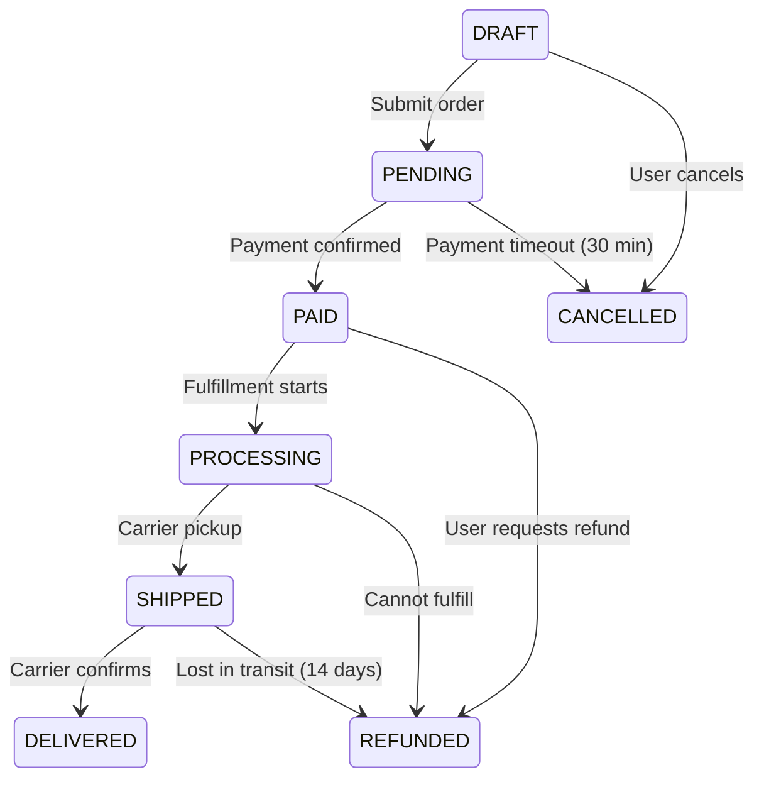
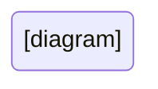

# FRD (Functional Requirements Document) Playbook

> **Purpose**: Guide the decomposition of product intent into verifiable functional behaviors that can be implemented and tested
> **Version**: 1.0
> **Status**: Authoritative
> **Last Updated**: 2024-12-31

---

## Mental Model

An FRD translates "what problem we're solving" (PRD) into "what the system must do" (functional behaviors). Every requirement should be testable—if you can't write a test for it, it's not a requirement.

```
PRD (Problem/Value) → FRD (Behaviors) → Tech Spec (Implementation)
        ↓                   ↓                    ↓
   "Why/What"         "What exactly"         "How"
```

**The Requirements Hierarchy:**
```
Goal (PRD)
├── Feature
│   ├── Capability
│   │   ├── Requirement (FRD level)
│   │   │   ├── Acceptance Criterion
│   │   │   └── Acceptance Criterion
│   │   └── Requirement
│   └── Capability
└── Feature
```

**The FRD Quality Ladder:**

| Level | State | Characteristics |
|-------|-------|-----------------|
| 0 | Vague | "Handle user login" — no specifics |
| 1 | Directional | Behaviors listed but incomplete |
| 2 | Structured | Requirements organized, still gaps |
| 3 | Complete | All behaviors specified |
| 4 | Testable | Each requirement has acceptance criteria |
| 5 | Edge-aware | Error states and boundaries defined |

**Target: Level 4-5 before moving to technical specification.**

---

## Inputs / Outputs

### Inputs
- **PRD**: Problem statement, success criteria, scope, users
- **User Research**: Workflows, edge cases from real usage
- **Domain Knowledge**: Business rules, regulatory requirements
- **Existing System**: Current behaviors to preserve or change
- **Technical Constraints**: Known limitations that affect requirements

### Outputs
- **FRD Document**: Complete functional requirements
- **Acceptance Criteria**: Testable conditions for each requirement
- **State Diagrams**: System states and transitions
- **Data Requirements**: What data the system handles
- **Traceability Matrix**: Requirements → PRD goals mapping

---

## Evaluation Dimensions

### Dimension 1: Functional Completeness
Every behavior the system must exhibit should be documented. Missing behaviors become missing features or undefined behavior in production.

**Probing Questions:**
- What are ALL the things the system must do?
- Walk through a user's complete workflow—what's missing?
- What happens at each decision point?
- Are there batch/scheduled/background behaviors?
- What administrative or operational functions exist?

**Red Flags:**
- "The system handles X" without specifics
- Missing CRUD operations (Create exists, Delete doesn't)
- No mention of edge workflows
- Admin/ops functions forgotten

**Good Example:**
```
## User Authentication

### REQ-AUTH-001: User Login
The system SHALL allow users to authenticate with email and password.

### REQ-AUTH-002: Login Failure Handling
The system SHALL display an error message after invalid credentials.
The system SHALL NOT reveal whether email or password was incorrect.

### REQ-AUTH-003: Account Lockout
The system SHALL lock an account after 5 consecutive failed login attempts.
The system SHALL unlock the account after 30 minutes OR manual admin unlock.

### REQ-AUTH-004: Session Management
The system SHALL create a session valid for 24 hours after successful login.
The system SHALL allow users to log out, invalidating the session.
The system SHALL invalidate all sessions when password is changed.

### REQ-AUTH-005: Password Reset
The system SHALL allow users to request a password reset via email.
[See REQ-RESET-* for detailed reset flow]
```

**Bad Example:**
```
## User Authentication
The system handles user login.
```

---

### Dimension 2: Input/Output Contracts
Every system interaction has inputs and outputs. Define them precisely to prevent integration failures and ambiguity.

**Probing Questions:**
- What data does each function receive?
- What data does each function produce?
- What are the valid formats and ranges?
- What validation rules apply to inputs?
- What transformations happen to data?

**Red Flags:**
- "Accepts user data" (what data?)
- No validation rules specified
- Output format undefined
- Missing field-level requirements

**Good Example:**
```
### REQ-USER-010: Create User Account

**Inputs:**
| Field | Type | Required | Validation |
|-------|------|----------|------------|
| email | string | Yes | Valid email format, unique in system |
| password | string | Yes | Min 8 chars, 1 upper, 1 lower, 1 number |
| firstName | string | Yes | 1-50 chars, letters/hyphens/apostrophes |
| lastName | string | Yes | 1-50 chars, letters/hyphens/apostrophes |
| phone | string | No | E.164 format if provided |

**Outputs (Success):**
| Field | Type | Description |
|-------|------|-------------|
| userId | UUID | Unique identifier for created user |
| email | string | Confirmed email address |
| createdAt | ISO8601 | Account creation timestamp |

**Outputs (Failure):**
| Condition | Error Code | Message |
|-----------|------------|---------|
| Email exists | EMAIL_EXISTS | "An account with this email already exists" |
| Invalid email | INVALID_EMAIL | "Please enter a valid email address" |
| Weak password | WEAK_PASSWORD | "Password must contain..." |
```

**Bad Example:**
```
### REQ-USER-010: Create User Account
System creates a user with their information.
```

---

### Dimension 3: State Transitions
Systems have states. Define what states exist, what transitions are valid, and what triggers them. Missing state logic causes bugs.

**Probing Questions:**
- What states can this entity/process be in?
- What transitions are allowed between states?
- What triggers each transition?
- Are there terminal states?
- What happens to related entities when state changes?

**Red Flags:**
- No state enumeration
- Implicit states ("it's kind of pending")
- Missing transition triggers
- No handling of invalid transitions

**Good Example:**
```
### REQ-ORDER-020: Order State Machine

**States:**
| State | Description |
|-------|-------------|
| DRAFT | Order created, not yet submitted |
| PENDING | Submitted, awaiting payment |
| PAID | Payment received, awaiting fulfillment |
| PROCESSING | Being prepared for shipment |
| SHIPPED | Handed to carrier |
| DELIVERED | Confirmed delivery |
| CANCELLED | Order cancelled |
| REFUNDED | Payment returned to customer |

**Transitions:**


**Transition Rules:**
- DRAFT → PENDING: Requires all required fields populated
- PENDING → CANCELLED: Automatic after 30 minutes without payment
- PAID → REFUNDED: Only within 24 hours of payment, before PROCESSING
- SHIPPED → DELIVERED: Requires carrier confirmation OR 14 days elapsed
```

**Bad Example:**
```
Orders go through various stages from creation to delivery.
```

---

### Dimension 4: Error Handling
Every operation can fail. Define what failures are possible and how the system responds. Unspecified errors become undefined behavior.

**Probing Questions:**
- What can go wrong with each operation?
- What does the user see for each error?
- Are errors recoverable or fatal?
- What's logged vs. displayed?
- Are there different error responses for different consumers?

**Red Flags:**
- No error cases listed
- Generic "show error message"
- No distinction between user errors and system errors
- Sensitive information in error messages

**Good Example:**
```
### REQ-PAY-030: Process Payment - Error Handling

| Error Condition | User Message | System Action | Retry? |
|-----------------|--------------|---------------|--------|
| Card declined | "Payment declined. Please try another card." | Log attempt, don't store card | Yes |
| Insufficient funds | "Payment declined. Please try another card." | Log attempt | Yes |
| Card expired | "This card has expired. Please update." | Log, prompt card update | Yes |
| Invalid CVV | "Security code is incorrect." | Log attempt | Yes |
| Fraud detected | "Payment could not be processed." | Flag account, alert fraud team | No |
| Gateway timeout | "Payment processing delayed. Please wait." | Retry 3x, then queue | Auto |
| Gateway down | "Payments temporarily unavailable." | Alert ops, show maintenance | No |

**Security Rules:**
- NEVER display full card number in any error
- NEVER reveal specific fraud detection triggers
- Log all payment attempts with masked card (last 4 only)
```

**Bad Example:**
```
Show appropriate error messages when payment fails.
```

---

### Dimension 5: Edge Cases
Boundaries and exceptions define system behavior in unusual conditions. Missing edge cases cause production incidents.

**Probing Questions:**
- What happens at the boundaries? (0, 1, max, empty)
- What happens with unusual but valid input?
- What about concurrent operations?
- What about timing edge cases?
- What about data that doesn't fit the model?

**Red Flags:**
- Only happy path documented
- No boundary conditions
- No concurrency considerations
- "Handle appropriately" for edge cases

**Good Example:**
```
### REQ-CART-040: Shopping Cart - Edge Cases

**Quantity Boundaries:**
- Quantity = 0: Remove item from cart
- Quantity = 1: Minimum valid quantity
- Quantity > stock: Set to max available, show warning
- Quantity > 99: Reject, show "Maximum 99 per item"

**Empty States:**
- Empty cart: Show "Your cart is empty" with suggested products
- Last item removed: Transition to empty state

**Concurrency:**
- Same user, two tabs: Last write wins, sync on page focus
- Item goes out of stock while in cart: Show warning at checkout, allow removal
- Price changes while in cart: Update price, notify user before checkout

**Timing:**
- Cart abandonment: Cart persists for 30 days, then cleared
- Session expiry: Cart persists (tied to user, not session)
- Flash sale ends: Honor price if item added during sale
```

**Bad Example:**
```
Handle edge cases appropriately.
```

---

### Dimension 6: Testability
Every requirement must be verifiable. If you can't write a test case, it's not a requirement—it's a wish.

**Probing Questions:**
- Can you write a test case for this requirement?
- What are the acceptance criteria?
- What's the pass/fail condition?
- Can this be tested in isolation?
- What test data is needed?

**Red Flags:**
- Subjective criteria ("user-friendly")
- Requirements that can't be automated
- No acceptance criteria
- Criteria that require production data

**Good Example:**
```
### REQ-SEARCH-050: Search Response Time

**Requirement:**
The system SHALL return search results within 500ms for 95% of queries.

**Acceptance Criteria:**
- AC1: Given a catalog of 1M products, when user searches a common term, then results display in <500ms
- AC2: Given a catalog of 1M products, when running 1000 random searches, then 95% complete in <500ms
- AC3: Given degraded database performance, when search exceeds 2s, then timeout error displayed

**Test Cases:**
| ID | Precondition | Action | Expected Result |
|----|--------------|--------|-----------------|
| TC-SEARCH-050-1 | 1M product catalog | Search "shoes" | Results in <500ms |
| TC-SEARCH-050-2 | 1M product catalog | 1000 random searches | 95%ile <500ms |
| TC-SEARCH-050-3 | DB latency injected at 3s | Search "shoes" | Timeout error in <3s |
```

**Bad Example:**
```
### REQ-SEARCH-050: Search Performance
Search should be fast.
```

---

## Extended Question Bank

### Completeness
1. List every action a user can take—what's missing?
2. What happens before the first action? After the last?
3. Are there scheduled/background jobs that aren't user-triggered?
4. What admin functions exist?
5. What reporting or analytics requirements exist?

### Input/Output
6. For each input field: type, format, validation, required?
7. For each output: structure, when null/empty, error cases?
8. What happens with malformed input?
9. Are there pagination, filtering, sorting requirements?
10. What about file uploads/downloads?

### States & Transitions
11. Draw the state machine—does it cover all paths?
12. What's the initial state? Terminal states?
13. Can any transition be reversed?
14. What happens to child entities on state change?
15. Are there time-based transitions?

### Error Handling
16. What's every way this operation can fail?
17. What does the user see vs. what gets logged?
18. Are errors localized/translated?
19. What errors need alerts/escalation?
20. How does the system recover from errors?

### Edge Cases
21. What happens with zero items? One item? Max items?
22. What about empty strings? Null? Whitespace?
23. What if two users do the same thing simultaneously?
24. What happens at midnight? Month-end? Year-end?
25. What about Unicode, RTL languages, emoji in text fields?

### Testability
26. Can every requirement be automated in tests?
27. What test data is required?
28. Are there requirements that need manual verification?
29. What's the acceptance criteria for subjective requirements?
30. How do you test integrations with external systems?

---

## Common Pitfalls

| Pitfall | Symptom | Fix |
|---------|---------|-----|
| **Vague behaviors** | "System handles X" | Specify exact behavior with inputs/outputs |
| **Missing states** | Bugs in transitions | Draw state machine, enumerate all states |
| **Happy path only** | Production errors | Add error cases and edge cases |
| **Untestable criteria** | "Should be user-friendly" | Rewrite as measurable acceptance criteria |
| **Scope leakage** | FRD grows beyond PRD | Trace each requirement to PRD goal |
| **Implicit validation** | Bad data in system | Explicit validation rules per field |
| **Missing concurrency** | Race conditions | Specify concurrent behavior explicitly |
| **Assumed behavior** | "Obviously it should..." | Make all behaviors explicit |
| **Orphan requirements** | Requirements without purpose | Trace every requirement to user need |
| **Gold plating** | Features beyond scope | Stick to PRD success criteria |

---

## FRD Template

```markdown
# FRD: [Feature Name]

> **PRD Reference:** [Link to PRD]
> **Owner:** [Name]
> **Status:** [Draft | Review | Approved]
> **Version:** [X.X]
> **Last Updated:** [YYYY-MM-DD]

---

## Overview

**Purpose:** [What this feature does]
**Users:** [Who uses it, from PRD]
**Success Criteria:** [From PRD, what this enables]

---

## Requirements

### [Functional Area 1]

#### REQ-XXX-001: [Requirement Name]

**Description:**
The system SHALL [specific behavior].

**Inputs:**
| Field | Type | Required | Validation |
|-------|------|----------|------------|
| [field] | [type] | [Yes/No] | [rules] |

**Outputs:**
| Field | Type | Description |
|-------|------|-------------|
| [field] | [type] | [description] |

**Acceptance Criteria:**
- AC1: Given [precondition], when [action], then [result]
- AC2: Given [precondition], when [action], then [result]

**Error Handling:**
| Condition | Response |
|-----------|----------|
| [error] | [behavior] |

---

### [Functional Area 2]

[Repeat structure]

---

## State Diagrams

### [Entity] State Machine



**State Definitions:**
| State | Description | Entry Condition |
|-------|-------------|-----------------|
| [state] | [description] | [when entered] |

---

## Data Requirements

### [Entity Name]

| Field | Type | Constraints | Description |
|-------|------|-------------|-------------|
| [field] | [type] | [constraints] | [description] |

---

## Edge Cases

| Scenario | Behavior |
|----------|----------|
| [edge case] | [how system responds] |

---

## Non-Functional Requirements

| Requirement | Target | Measurement |
|-------------|--------|-------------|
| [Performance] | [target] | [how measured] |

---

## Traceability Matrix

| Requirement ID | PRD Goal | Test Case |
|----------------|----------|-----------|
| REQ-XXX-001 | [PRD reference] | TC-XXX-001 |

---

## Open Questions

- [ ] [Question]

---

## Changelog

| Version | Date | Author | Changes |
|---------|------|--------|---------|
| X.X | YYYY-MM-DD | [Name] | [Changes] |
```

---

## Invariants

1. **Every requirement MUST have acceptance criteria** — if you can't test it, it's not a requirement
2. **Every input MUST have validation rules** — undefined validation = undefined behavior
3. **Every error MUST have a specified response** — unhandled errors cause incidents
4. **State machines MUST be complete** — every state, every valid transition
5. **Requirements MUST trace to PRD** — orphan requirements indicate scope creep
6. **Edge cases MUST be documented** — boundaries are where bugs live
7. **Requirements MUST be uniquely identified** — REQ-XXX-NNN format for traceability
8. **FRD MUST NOT include implementation details** — "what" not "how"

---

## Artifact Lineage

```
      PRD
       ↓
     FRD  ← (You are here)
       ↓
 Technical Spec
       ↓
Implementation Plan
```

**Handoff to Tech Spec:**
- All behaviors documented
- Acceptance criteria defined
- States and transitions complete
- Edge cases enumerated
- Ready for implementation design

---

## Version History

| Version | Date | Changes |
|---------|------|---------|
| 1.0 | 2024-12-31 | Initial playbook: 6 dimensions, 30-question bank, template, invariants |

---

*Requirements Analyst — Decomposing intent into verifiable, testable behaviors.*
