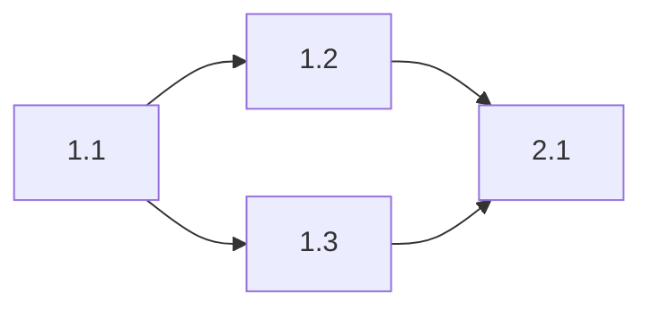

# Implementation Plan Playbook

> **Purpose**: Guide the creation of phased, executable implementation plans that bridge specs to code through AI-assisted workflows
> **Version**: 1.0
> **Last Updated**: 2024-12-31

---

## Mental Model

An implementation plan is a contract between the architect (you) and the executor (AI coding agents). It translates "what to build" into "how to build it, step by step."

```
Spec/Design → Phases → Tasks → Dependencies → Execution Batches → Validation
     ↓           ↓        ↓          ↓               ↓              ↓
  "What"    "Stages"  "Units"  "Order"       "Parallel work"   "Done?"
```

**The Implementation Plan Quality Ladder:**

| Level | State | Characteristics |
|-------|-------|-----------------|
| 0 | Wishlist | "Build the feature" — no structure |
| 1 | Outlined | Phases exist but vague |
| 2 | Decomposed | Tasks identified, still fuzzy boundaries |
| 3 | Sequenced | Dependencies mapped, order clear |
| 4 | Executable | Tasks precise enough for AI to execute |
| 5 | Validated | Acceptance criteria defined, parallelism identified |

**Target: Level 4-5 before passing to coding agents.**

---

## Inputs / Outputs

### Inputs
- **Source Artifact**: PRD, FRD, Technical Spec, or Reference Architecture
- **Scope**: What's included in this implementation cycle
- **Constraints**: Timeline, resources, technical limitations
- **Risk Context**: Known risks from upstream artifacts
- **Environment**: Where will this run? (Codeswarm, local, CI/CD)

### Outputs
- **Implementation Plan**: Phased, task-level document ready for execution
- **Dependency Graph**: Visual or textual representation of task dependencies
- **Execution Batches**: Groups of parallelizable work
- **Validation Checklist**: How to verify each phase is complete

---

## Evaluation Dimensions

### Dimension 1: Phase Clarity
Phases are logical stages of work. Each phase should have a clear entry point, exit criteria, and deliverables.

**Probing Questions:**
- How many phases does this implementation require?
- What's the deliverable at the end of each phase?
- Are phases sized appropriately (1-5 days each)?
- Can phases be completed independently?
- What makes a phase "done"?

**Red Flags:**
- Single mega-phase (no decomposition)
- Phases with unclear boundaries
- Phases that depend on incomplete prior phases

**Good Example:**
```
Phase 1: Data Layer (2 days)
- Deliverable: Database schema + migrations + repository interfaces
- Exit Criteria: Migrations run successfully, repositories pass unit tests

Phase 2: API Layer (2 days)  
- Deliverable: REST endpoints + validation + error handling
- Exit Criteria: API contract tests pass, Postman collection works
```

**Bad Example:**
```
Phase 1: Build the backend
```

---

### Dimension 2: Task Granularity
Tasks are the atomic units of work. Each task should be small enough to verify independently and precise enough for an AI to execute.

**Probing Questions:**
- Can each task be completed in under 2 hours?
- Is the task description precise enough to code from?
- Can you verify the task is done without running the whole system?
- Are tasks at a consistent level of granularity?
- Would a different developer (or AI) interpret this task the same way?

**Red Flags:**
- "Implement the feature" (too big)
- Mixed abstraction levels (some tiny, some huge)
- Tasks that require clarification to start

**Good Example:**
```
Task 1.3: Create User repository interface
- File: src/repositories/UserRepository.ts
- Methods: findById(id: string), create(user: User), update(user: User), delete(id: string)
- Returns: Promise<User | null> for find, Promise<User> for create/update, Promise<void> for delete
- Acceptance: Interface compiles, matches User entity from Task 1.1
```

**Bad Example:**
```
Task 1.3: Handle users
```

---

### Dimension 3: Dependency Mapping
Tasks have dependencies. Some must complete before others can start. Clear dependency mapping enables parallelization and prevents blockers.

**Probing Questions:**
- Which tasks block other tasks?
- Which tasks can run in parallel?
- Are there circular dependencies? (If so, redesign)
- What's the critical path (longest dependency chain)?
- Are there hidden dependencies not captured?

**Red Flags:**
- No dependencies mapped (everything sequential by default)
- Circular dependencies
- Critical path not identified
- Dependencies on external factors not called out

**Good Example:**
```
Task 1.1: Define User entity         → (no dependencies)
Task 1.2: Define UserDTO             → depends on 1.1
Task 1.3: Create User repository     → depends on 1.1
Task 1.4: Create User service        → depends on 1.3
Task 1.5: Create User controller     → depends on 1.4, 1.2

Parallel batch: [1.2, 1.3] can run after 1.1
```

**Bad Example:**
```
Task 1, then Task 2, then Task 3... (no parallelism considered)
```

---

### Dimension 4: Acceptance Criteria
Every task needs a "done" definition. Without acceptance criteria, you can't verify completion or catch regressions.

**Probing Questions:**
- How do you know this task is complete?
- What tests or checks validate the task?
- Is acceptance automated or manual?
- Can the AI self-verify, or does it need human review?
- What's the minimum bar for "acceptable"?

**Red Flags:**
- No acceptance criteria (just "do it")
- Subjective criteria ("looks good")
- Criteria that require full system to test

**Good Example:**
```
Task 1.3 Acceptance Criteria:
- [ ] UserRepository.ts exists in src/repositories/
- [ ] Implements all 4 methods from interface
- [ ] Compiles without errors (npm run typecheck)
- [ ] Unit tests pass (npm test -- UserRepository)
```

**Bad Example:**
```
Task 1.3: (no acceptance criteria)
```

---

### Dimension 5: Risk Checkpoints
Some tasks carry more risk than others. Identify checkpoints where you pause, validate, and decide whether to proceed.

**Probing Questions:**
- Which tasks have the highest risk of failure?
- Where should you stop and validate before continuing?
- Are there go/no-go decision points?
- What's the rollback plan if a phase fails?
- Which tasks touch production data or systems?

**Red Flags:**
- No risk checkpoints (full steam ahead)
- High-risk tasks buried in the middle
- No rollback strategy

**Good Example:**
```
⚠️ CHECKPOINT after Phase 1:
- All migrations run on local + staging
- Repository tests pass
- Data model reviewed against FRD
- GO/NO-GO: Proceed to API layer only if data layer is solid
```

**Bad Example:**
```
(No checkpoints — discover problems in production)
```

---

### Dimension 6: Parallelization Opportunities
Sequential execution wastes time. Identify what can run concurrently to maximize throughput.

**Probing Questions:**
- Which tasks are truly independent?
- How many parallel streams can run safely?
- What's the optimal batch size for your environment?
- Are there resource conflicts that prevent parallelism?
- What's the speedup from parallelization?

**Red Flags:**
- Everything sequential (no parallelism identified)
- Parallelism without considering resource limits
- Conflicts between parallel tasks

**Good Example:**
```
Execution Batches (Phase 2):

Batch 2.1 (parallel, 3 tasks):
├── Task 2.1: Create UserController
├── Task 2.2: Create ProductController
└── Task 2.3: Create OrderController

Batch 2.2 (sequential, after 2.1):
└── Task 2.4: Integration tests for all controllers

Parallelization: 70% of Phase 2 tasks run concurrently
```

**Bad Example:**
```
Task 2.1, then 2.2, then 2.3, then 2.4... (0% parallelization)
```

---

## Extended Question Bank

### Phase Design
1. What's the natural breakdown of this work into stages?
2. What must be true before each phase can begin?
3. What's the deliverable that proves a phase is complete?
4. Are there external dependencies between phases (APIs, data, approvals)?
5. What's the riskiest phase, and why?

### Task Decomposition
6. If I gave this task to an AI coding agent, would it know exactly what to produce?
7. Can this task be broken down further, or is it atomic?
8. What files will this task create or modify?
9. What's the expected output format (code, config, docs)?
10. How long should this task take? (If >2 hours, split it)

### Dependency Analysis
11. Draw the dependency graph — what blocks what?
12. What's the critical path through this plan?
13. Are there any tasks that everything else depends on? (Reduce risk on these)
14. Can any long sequential chains be restructured for parallelism?
15. Are there external dependencies (APIs, packages, approvals) to track?

### Acceptance Criteria
16. What command or test proves this task is done?
17. Can the AI self-verify, or does it need human review?
18. What's the minimum viable acceptance (vs. gold-plated)?
19. Are acceptance criteria automatable?
20. What happens if acceptance fails — retry, escalate, or rollback?

### Risk & Checkpoints
21. Where are the "point of no return" moments?
22. What's the worst-case outcome if this phase fails?
23. How do you detect failure early?
24. What's the rollback plan for each phase?
25. Are there any irreversible operations (data migrations, external API calls)?

### Parallelization
26. What's the maximum parallelism your environment supports?
27. Are there shared resources that create conflicts (database, files, ports)?
28. What's the estimated speedup from parallelizing?
29. How do you handle failures in parallel tasks (fail-fast, continue, retry)?
30. Can you batch similar tasks together for efficiency?

---

## Common Pitfalls

| Pitfall | Symptom | Fix |
|---------|---------|-----|
| **Tasks too big** | AI produces incomplete or wrong output | Split into 1-2 hour chunks |
| **Tasks too vague** | AI asks clarifying questions or guesses | Add file paths, method signatures, schemas |
| **Missing dependencies** | Task fails because prior work isn't done | Map dependencies explicitly before executing |
| **No acceptance criteria** | Can't tell if task is done | Add testable checklist per task |
| **Over-sequencing** | Execution takes forever | Identify parallel batches |
| **Hidden dependencies** | Tasks fail unexpectedly | Review with "what does this assume exists?" |
| **No checkpoints** | Discover problems late | Add go/no-go points after risky phases |
| **Scope creep** | Plan keeps growing | Lock scope at start, track additions separately |
| **Wrong abstraction** | Some tasks are files, others are features | Normalize granularity across plan |
| **No model assignment** | Wrong AI handles task | Tag tasks with Codex/Sonnet/Haiku |

---

## Implementation Plan Template

```markdown
# Implementation Plan: [Feature/Project Name]

> **Source**: [Link to PRD/FRD/TechSpec]
> **Scope**: [What's in/out]
> **Version**: [X.X]
> **Last Updated**: [YYYY-MM-DD]

---

## Overview

[2-3 sentences describing what this plan implements]

**Total Phases**: [N]
**Estimated Duration**: [X days]
**Parallelization Target**: [>70% recommended]

---

## Phase 1: [Phase Name]

**Goal**: [What this phase accomplishes]
**Duration**: [X days]
**Deliverables**: [What's produced]

### Tasks

| ID | Task | Depends On | Model | Acceptance Criteria |
|----|------|------------|-------|---------------------|
| 1.1 | [Description] | — | Codex | [Criteria] |
| 1.2 | [Description] | 1.1 | Codex | [Criteria] |
| 1.3 | [Description] | 1.1 | Codex | [Criteria] |

### Execution Batches

**Batch 1.A** (sequential):
- Task 1.1

**Batch 1.B** (parallel, after 1.A):
- Task 1.2
- Task 1.3

### Phase 1 Checkpoint

⚠️ **GO/NO-GO after Phase 1:**
- [ ] [Validation criterion 1]
- [ ] [Validation criterion 2]
- [ ] [Human review point if needed]

---

## Phase 2: [Phase Name]

[Repeat structure]

---

## Dependency Graph



---

## Risk Register

| Risk | Impact | Likelihood | Mitigation |
|------|--------|------------|------------|
| [Risk] | High/Med/Low | High/Med/Low | [Action] |

---

## Rollback Plan

**Phase 1 rollback**: [How to undo]
**Phase 2 rollback**: [How to undo]

---

## Notes

[Additional context, gotchas, decisions made during planning]
```

---

## Invariants

1. **Every task MUST be executable by an AI coding agent** — if it requires human intuition, make it a checkpoint
2. **Every task MUST have acceptance criteria** — no "done when I say so"
3. **Dependencies MUST be explicit** — implicit dependencies cause failures
4. **Parallelization SHOULD exceed 70%** — sequential plans waste time
5. **Checkpoints MUST exist after risky phases** — fail fast, not late
6. **Tasks SHOULD be 1-2 hours max** — bigger tasks get split
7. **Model tier SHOULD be assigned per task** — right model for the job (Codex for code, Haiku for validation)
8. **Rollback plans MUST exist for phases touching data** — assume failure is possible

---

## Integration with Bryan's Workflow

This playbook feeds directly into the execution pipeline:

```
Implementation Plan → /-codex_prompt → Execution Spec → Codex Batches → Validation
```

**Handoff criteria to `/-codex_prompt`:**
- All phases defined
- All tasks have acceptance criteria
- Dependencies mapped
- Execution batches identified
- Model tiers assigned

---

## Version History

| Version | Date | Changes |
|---------|------|---------|
| 1.0 | 2024-12-31 | Initial playbook: 6 dimensions, 30-question bank, template, invariants |

---

*Delivery Planner — Translating specs into phased, executable work that AI agents can run.*
