# Mermaid Diagram Guide

> **Purpose**: Guide the creation of effective Mermaid diagrams that communicate clearly across all artifact types
> **Version**: 1.0
> **Last Updated**: 2024-12-31

---

## Mental Model

A diagram is worth a thousand words—if it's the right diagram. Wrong diagram type or poor execution creates confusion, not clarity.

```
Purpose → Diagram Type → Content → Layout → Style
    ↓           ↓           ↓        ↓        ↓
 "Why"     "Which kind"  "What"   "How"   "Polish"
```

**The Diagram Selection Matrix:**

| You Want to Show | Use This | Mermaid Type |
|------------------|----------|--------------|
| Process flow, decisions | Flowchart | `flowchart` |
| Component interactions over time | Sequence Diagram | `sequenceDiagram` |
| System structure, containers | C4 / Architecture | `C4Context`, `flowchart` |
| Data entities & relationships | Entity Relationship | `erDiagram` |
| States & transitions | State Machine | `stateDiagram-v2` |
| Class structure | Class Diagram | `classDiagram` |
| Timeline, schedule | Gantt Chart | `gantt` |
| Hierarchy, org chart | Flowchart (TB) | `flowchart TB` |
| Mind map, concepts | Mind Map | `mindmap` |
| User journey | User Journey | `journey` |

**The Diagram Quality Ladder:**

| Level | State | Characteristics |
|-------|-------|-----------------|
| 0 | Napkin | Scribbled boxes, unclear purpose |
| 1 | Drafted | Right type, content incomplete |
| 2 | Complete | All elements present, hard to read |
| 3 | Readable | Clear layout, inconsistent style |
| 4 | Polished | Consistent style, good visual hierarchy |
| 5 | Publication-ready | Legend, title, optimal detail level |

**Target: Level 4-5 for documentation; Level 3 for working drafts.**

---

## Diagram Types Deep Dive

### 1. Flowchart

**Best For:** Process flows, decision trees, algorithms, system overviews

**When to Use:**
- Showing step-by-step processes
- Decision logic with branches
- High-level system architecture
- Data flow between components

**Syntax Basics:**


**Direction Options:**
- `TB` / `TD` — Top to Bottom (default)
- `BT` — Bottom to Top
- `LR` — Left to Right (good for processes)
- `RL` — Right to Left

**Node Shapes:**


| Shape | Meaning | Use For |
|-------|---------|---------|
| `[text]` | Rectangle | Process, action |
| `(text)` | Rounded | Start/end |
| `[(text)]` | Stadium | Terminal |
| `[[text]]` | Subroutine | External process |
| `[(text)]` | Cylinder | Database |
| `((text))` | Circle | Connector |
| `{text}` | Diamond | Decision |
| `{{text}}` | Hexagon | Preparation |

**Edge Styles:**


**Subgraphs for Grouping:**


**Good Example — API Request Flow:**


---

### 2. Sequence Diagram

**Best For:** API interactions, service communication, message flow over time

**When to Use:**
- Showing request/response patterns
- Multi-service interactions
- Protocol flows (auth, payment)
- Debugging distributed systems

**Syntax Basics:**


**Arrow Types:**
| Arrow | Meaning |
|-------|---------|
| `->` | Solid line (sync call) |
| `-->` | Dotted line (response) |
| `->>` | Solid with arrowhead |
| `-->>` | Dotted with arrowhead |
| `-x` | Solid with X (async/fire-forget) |
| `--x` | Dotted with X |

**Advanced Features:**


**Key Constructs:**
- `activate`/`deactivate` — Show processing time
- `alt`/`else`/`end` — Conditional flows
- `loop`/`end` — Repeated actions
- `opt`/`end` — Optional section
- `par`/`and`/`end` — Parallel actions
- `Note over`/`Note left of`/`Note right of` — Annotations

**Good Example — OAuth Flow:**


---

### 3. Entity Relationship Diagram

**Best For:** Data models, database schema, entity relationships

**When to Use:**
- Designing database schema
- Documenting data models
- Showing relationships between entities
- Planning migrations

**Syntax Basics:**


**Cardinality Notation:**
| Symbol | Meaning |
|--------|---------|
| `\|\|` | Exactly one |
| `o\|` | Zero or one |
| `}\|` | One or more |
| `o{` | Zero or more |

**With Attributes:**


**Attribute Markers:**
- `PK` — Primary Key
- `FK` — Foreign Key
- `UK` — Unique Key

**Good Example — E-commerce Domain:**


---

### 4. State Diagram

**Best For:** State machines, lifecycle flows, status transitions

**When to Use:**
- Object lifecycle (order, user, document)
- Workflow states
- Protocol states
- UI state machines

**Syntax Basics:**


**Advanced Features:**


**Constructs:**
- `[*]` — Start/end state
- `state {}` — Composite state
- `note` — Annotations
- `<<fork>>` / `<<join>>` — Parallel states

**Good Example — Order Lifecycle:**


---

### 5. C4 Diagrams

**Best For:** Software architecture at multiple levels of abstraction

**C4 Levels:**
1. **Context** — System in its environment
2. **Container** — High-level tech building blocks
3. **Component** — Components within containers
4. **Code** — Class-level (use classDiagram)

**Context Diagram:**


**Container Diagram:**


---

### 6. Class Diagram

**Best For:** Object structure, interfaces, inheritance

**When to Use:**
- API request/response types
- Domain model design
- Interface definitions
- Inheritance hierarchies

**Syntax:**


**Relationship Types:**
| Symbol | Type |
|--------|------|
| `<\|--` | Inheritance |
| `*--` | Composition |
| `o--` | Aggregation |
| `-->` | Association |
| `..>` | Dependency |
| `..\|>` | Realization |

---

### 7. Gantt Chart

**Best For:** Project timelines, schedules, dependencies

**Syntax:**


---

## Best Practices

### Do's

1. **Choose the right diagram type**
   - Process flow → Flowchart
   - Time-based interaction → Sequence
   - Data model → ERD
   - Object lifecycle → State

2. **Keep it focused**
   - One diagram = one purpose
   - Split complex diagrams
   - Link related diagrams

3. **Use consistent styling**
   - Same shapes for same concepts
   - Consistent naming conventions
   - Uniform edge styles

4. **Provide context**
   - Add title (comment or note)
   - Use subgraphs for grouping
   - Include legend if needed

5. **Optimize layout**
   - Choose direction (LR for processes, TB for hierarchies)
   - Group related nodes
   - Minimize edge crossings

### Don'ts

1. **Don't overcrowd**
   - Max ~15 nodes per diagram
   - Split if more complex
   - Use layers of abstraction

2. **Don't mix abstractions**
   - Don't show classes and servers in same diagram
   - Keep consistent level of detail

3. **Don't over-style**
   - Avoid excessive colors
   - Keep labels concise
   - Don't use every shape available

4. **Don't forget the audience**
   - Technical vs non-technical
   - Explanation vs reference
   - Detail level appropriate

---

## Common Patterns by Artifact Type

### For PRD/FRD


### For Architecture

```mermaid
flowchart TB
    subgraph Presentation
        A[Web App]
        B[Mobile App]
    end
    
    subgraph Services
        C[API Gateway]
        D[Business Services]
    end
    
    subgraph Data
        E[(Primary DB)]
        F[(Cache)]
    end
    
    A & B --> C
    C --> D
    D --> E & F
```


### For Technical Spec
```mermaid
sequenceDiagram
    participant C as Client
    participant G as Gateway
    participant S as Service
    participant D as Database
    
    C->>G: Request
    G->>S: Validated Request
    S->>D: Query
    D-->>S: Result
    S-->>G: Response
    G-->>C: Final Response
```

### For Migration Plan
```mermaid
stateDiagram-v2
    [*] --> Current
    Current --> Preparation: Phase 1
    Preparation --> Migration: Phase 2
    Migration --> Validation: Phase 3
    Validation --> Cutover: Phase 4
    Cutover --> Cleanup: Phase 5
    Cleanup --> [*]: Complete
```

### For Implementation Plan
```mermaid
gantt
    title Implementation Phases
    
    section Phase 1 - Foundation
    Database setup    :p1a, 2024-01-01, 3d
    API scaffolding   :p1b, after p1a, 2d
    
    section Phase 2 - Core
    Business logic    :p2a, after p1b, 5d
    Integration       :p2b, after p2a, 3d
    
    section Phase 3 - Polish
    Testing           :p3a, after p2b, 4d
    Documentation     :p3b, after p2b, 2d
```

---

## Troubleshooting

| Problem | Solution |
|---------|----------|
| Diagram too wide | Use `TB` direction, or split diagram |
| Edges crossing | Reorder node definitions, use subgraphs |
| Text cut off | Shorten labels, use abbreviations |
| Rendering fails | Check syntax, especially quotes and special chars |
| Too cluttered | Remove detail, create sub-diagrams |
| Inconsistent look | Apply consistent shapes and naming |

### Escaping Special Characters
```mermaid
flowchart LR
    A["Label with (parens)"]
    B["Label with [brackets]"]
    C["Label with 'quotes'"]
```

### Line Breaks in Labels
```mermaid
flowchart LR
    A["Line 1<br/>Line 2"]
```

---

## Evaluation Dimensions for Diagram Review

### Dimension 1: Purpose Clarity
- Does the diagram have a clear purpose?
- Is the purpose stated (title/caption)?
- Does every element serve the purpose?

### Dimension 2: Type Appropriateness
- Is this the right diagram type?
- Would another type communicate better?
- Is the abstraction level consistent?

### Dimension 3: Content Completeness
- Are all necessary elements present?
- Are relationships complete?
- Is anything missing that would cause confusion?

### Dimension 4: Visual Clarity
- Is the layout readable?
- Are node and edge labels clear?
- Is there a logical visual flow?

### Dimension 5: Consistency
- Are naming conventions consistent?
- Are shapes used consistently for same concepts?
- Is styling uniform?

### Dimension 6: Detail Level
- Is detail appropriate for audience?
- Is anything too detailed or too vague?
- Could the diagram be simplified?

---

## Quick Reference

### Flowchart
```
flowchart LR
    A[Action] --> B{Decision}
    B -->|Yes| C[Result]
```

### Sequence
```
sequenceDiagram
    A->>B: Request
    B-->>A: Response
```

### ERD
```
erDiagram
    A ||--o{ B : has
```

### State
```
stateDiagram-v2
    [*] --> State1
    State1 --> State2
```

### Class
```
classDiagram
    class A {
        +field
        +method()
    }
```

### Gantt
```
gantt
    Task :a1, 2024-01-01, 7d
```

---

## Invariants

1. **Every diagram MUST have a clear purpose** — no "just because" diagrams
2. **Diagram type MUST match the content** — don't force flowcharts on everything
3. **Detail level MUST be consistent** — don't mix high and low abstraction
4. **Labels MUST be readable** — if you can't read it, simplify it
5. **Relationships MUST be explicit** — no assumed connections
6. **Style MUST be consistent** — same shapes mean same things
7. **Complex diagrams MUST be split** — max ~15 nodes per diagram
8. **Diagrams MUST stand alone** — understandable without prose (mostly)

---

## Version History

| Version | Date | Changes |
|---------|------|---------|
| 1.0 | 2024-12-31 | Initial guide: 7 diagram types, patterns, best practices, invariants |

---

*Visual Clarity Reviewer — Making the complex visible and the visible understandable.*
