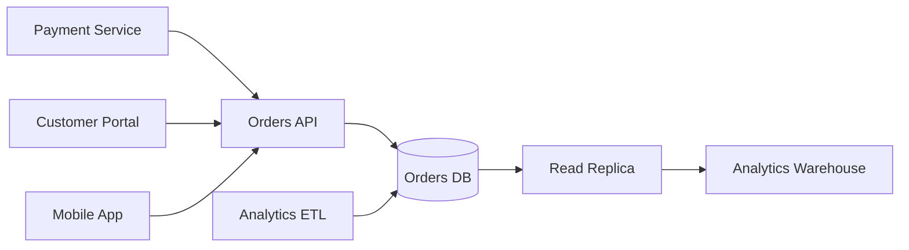

# Migration Plan Playbook

> **Purpose**: Guide the planning and execution of migrations—moving systems, data, or platforms from current state to target state with managed risk
> **Version**: 1.0
> **Last Updated**: 2024-12-31

---

## Mental Model

A migration is controlled change from a known state to a desired state. The key word is "controlled"—uncontrolled change is an outage. Every migration assumes things will go wrong and plans for it.

```
Current State → Preparation → Migration → Validation → Cutover → Cleanup
      ↓              ↓            ↓            ↓           ↓          ↓
  "Where we      "Get ready"   "Move"     "Verify"    "Switch"  "Finish"
   are now"
```

**The Migration Risk Pyramid:**
```
                    ▲
                   /│\
                  / │ \        DATA LOSS
                 /  │  \       (Unrecoverable)
                /───┼───\
               /    │    \     EXTENDED DOWNTIME
              /     │     \    (Hours/Days)
             /──────┼──────\
            /       │       \  PARTIAL MIGRATION
           /        │        \ (Inconsistent State)
          /─────────┼─────────\
         /          │          \ PERFORMANCE DEGRADATION
        /           │           \(Slow but functional)
       /────────────┼────────────\
      /             │             \ ROLLBACK REQUIRED
     /              │              \(Back to start)
    ▔▔▔▔▔▔▔▔▔▔▔▔▔▔▔▔▔▔▔▔▔▔▔▔▔▔▔▔▔▔▔▔
              INCREASING SEVERITY
```

**The Migration Quality Ladder:**

| Level | State | Characteristics |
|-------|-------|-----------------|
| 0 | Wishful | "We'll migrate over the weekend" |
| 1 | Outlined | Steps listed, details missing |
| 2 | Planned | Detailed steps, no rollback |
| 3 | Validated | Rollback defined, tested in staging |
| 4 | Rehearsed | Dry run completed, timing known |
| 5 | Production-ready | All checkpoints defined, team trained |

**Target: Level 4-5 before executing any production migration.**

---

## Inputs / Outputs

### Inputs
- **Current State Documentation**: What exists today
- **Target State Definition**: Where we're going (architecture, spec)
- **Constraints**: Downtime windows, compliance, dependencies
- **Risk Tolerance**: What level of risk is acceptable
- **Rollback Requirements**: How far back must we be able to go

### Outputs
- **Migration Plan Document**: Complete execution guide
- **Runbook**: Step-by-step execution procedures
- **Rollback Plan**: How to reverse if needed
- **Validation Checklist**: How to verify success
- **Communication Plan**: Who knows what when

---

## Evaluation Dimensions

### Dimension 1: Current State Clarity
You can't migrate from somewhere you don't understand. Incomplete current state analysis causes surprise failures.

**Probing Questions:**
- What exactly exists today? (Systems, data, integrations)
- What's the data volume and structure?
- What are all the dependencies (upstream, downstream)?
- What's undocumented or only in someone's head?
- What's the current performance baseline?

**Red Flags:**
- "It's pretty much like the docs say"
- Unknown data volumes
- Undiscovered integrations
- No performance baseline

**Good Example:**
```
## Current State

### System Inventory
| Component | Version | Host | Dependencies | Data Volume |
|-----------|---------|------|--------------|-------------|
| Orders DB | PostgreSQL 11.4 | db-prod-1 | App servers, Analytics | 450GB, 12M rows |
| Orders API | Node 14.x | k8s-prod | Orders DB, Auth, Payments | N/A |
| Analytics ETL | Airflow 2.1 | airflow-prod | Orders DB, Warehouse | N/A |

### Data Inventory
| Table | Rows | Size | Growth/Day | Last Backup |
|-------|------|------|------------|-------------|
| orders | 12M | 380GB | 50K rows | 2024-12-31 02:00 |
| order_items | 45M | 65GB | 180K rows | 2024-12-31 02:00 |
| order_events | 200M | 120GB | 2M rows | 2024-12-31 02:00 |

### Integration Map


### Undocumented Dependencies (Discovered)
- Legacy reporting cron job queries Orders DB directly (not through API)
- Finance team has Excel connections to read replica
- Monitoring uses direct DB connections for metrics
```

**Bad Example:**
```
## Current State
PostgreSQL database with order data, accessed by various services.
```

---

### Dimension 2: Target State Clarity
Where are we going? Vague targets lead to vague success criteria and scope creep.

**Probing Questions:**
- What exactly will exist after migration?
- What's different from current state?
- What's the expected performance/capacity?
- What new capabilities does target provide?
- What's explicitly NOT changing?

**Red Flags:**
- "Modern cloud-native architecture"
- No specific versions or configurations
- Unclear what changes vs. stays same
- No success metrics

**Good Example:**
```
## Target State

### System Changes
| Component | Current | Target | Change Type |
|-----------|---------|--------|-------------|
| Orders DB | PostgreSQL 11.4 | PostgreSQL 16.1 | Major upgrade |
| Host | Self-managed VM | AWS RDS | Platform change |
| Orders API | Node 14.x | Node 20.x | Runtime upgrade |
| Host | k8s-prod | k8s-prod (same) | No change |

### Target Configuration
- **Database:** RDS PostgreSQL 16.1
  - Instance: db.r6g.2xlarge (8 vCPU, 64GB RAM)
  - Storage: 1TB gp3, 3000 IOPS
  - Multi-AZ: Enabled
  - Encryption: AES-256 at rest
  - Backup: 7-day retention, PITR enabled
  
- **Expected Performance:**
  - Query latency: <5ms p50, <20ms p99 (same or better)
  - Connections: Up to 500 (vs current 100)
  - Failover: <60 seconds (vs current 5+ minutes manual)

### What's NOT Changing
- API contracts (all endpoints unchanged)
- Data schema (no schema migration in this phase)
- Application logic (only connection strings)
- Analytics pipeline (will point to new DB)
```

**Bad Example:**
```
## Target State
AWS RDS PostgreSQL with better performance and reliability.
```

---

### Dimension 3: Data Migration Strategy
How does data move? This is where most migrations fail. Every byte must be accounted for.

**Probing Questions:**
- How much data needs to move?
- What's the migration mechanism? (Dump/restore, replication, sync)
- How long will data migration take?
- How do you handle data created during migration?
- What's the data validation strategy?

**Red Flags:**
- "We'll export and import"
- No timing estimates
- No plan for in-flight data
- No validation strategy

**Good Example:**
```
## Data Migration Strategy

### Approach: Streaming Replication + Cutover

**Phase 1: Initial Sync (Estimated: 8 hours)**
1. Create RDS instance from snapshot (2 hours)
2. Establish logical replication from source (30 min setup)
3. Initial data sync via pglogical (6 hours for 450GB)
4. Replication lag target: <1 second

**Phase 2: Replication Monitoring (Duration: 24-48 hours)**
- Monitor replication lag continuously
- Target: Lag consistently <100ms
- Alert threshold: Lag >5 seconds

**Phase 3: Cutover (Estimated: 15 minutes)**
1. Stop writes to source (set read-only): 0:00
2. Wait for replication to catch up: 0:01
3. Verify row counts match: 0:03
4. Update connection strings (k8s config): 0:05
5. Rolling restart of application pods: 0:10
6. Verify application connectivity: 0:12
7. Resume traffic: 0:15

### In-Flight Data Handling
- Streaming replication captures all changes
- No data loss window (replication is continuous)
- Cutover window: ~5 minutes of read-only mode

### Data Validation
| Check | Method | Pass Criteria |
|-------|--------|---------------|
| Row counts | SQL count(*) | 100% match |
| Checksum (sample) | MD5 of 1000 random rows | 100% match |
| Recent data | Orders from last hour | All present |
| Referential integrity | FK constraint check | No violations |
| Application smoke test | Create test order | Success |
```

**Bad Example:**
```
## Data Migration
Export data from old database, import to new database.
```

---

### Dimension 4: Rollback Plan
Every migration needs an escape hatch. If you can't roll back, you can't safely migrate.

**Probing Questions:**
- How do you reverse this migration?
- How long does rollback take?
- What data might be lost in rollback?
- At what point does rollback become impossible?
- What triggers a rollback decision?

**Red Flags:**
- "We won't need to roll back"
- No rollback procedure documented
- Rollback takes longer than downtime window
- Point of no return not identified

**Good Example:**
```
## Rollback Plan

### Rollback Triggers
- [ ] Application error rate >1% for >5 minutes
- [ ] Data validation failures
- [ ] Replication corruption detected
- [ ] Performance degradation >50%
- [ ] Stakeholder decision (any reason)

### Rollback Procedure

**During Migration (Before Cutover):**
1. Stop migration process
2. Source database still active—no action needed
3. Destroy target RDS instance
4. Document what went wrong
- **Rollback time:** Immediate
- **Data loss:** None

**After Cutover (First 2 Hours):**
1. Switch connection strings back to source
2. Rolling restart of application pods
3. Keep target RDS for investigation
4. Replay any new data from target to source (if needed)
- **Rollback time:** 15 minutes
- **Data loss:** Potential for data created post-cutover

**After Cutover (2-24 Hours):**
1. Source database still has replication from target (reverse sync)
2. Stop target writes, sync to source
3. Switch connections back
4. More complex data reconciliation needed
- **Rollback time:** 1-2 hours
- **Data loss:** Minimal with careful reconciliation

**Point of No Return: 24 hours post-cutover**
- Source database will be decommissioned
- Full backup archived
- After this point, rollback = restore from backup (hours)

### Rollback Decision Authority
- **Technical decision:** On-call engineer (immediate issues)
- **Business decision:** Product owner (extended rollback)
- **No-go authority:** Anyone on migration team can stop
```

**Bad Example:**
```
## Rollback
If something goes wrong, we'll switch back to the old system.
```

---

### Dimension 5: Validation Checkpoints
How do you know the migration worked? Trust but verify—at every stage.

**Probing Questions:**
- What are the validation checks at each phase?
- What's the pass/fail criteria for each check?
- Who performs validation?
- What automated checks exist?
- What manual verification is required?

**Red Flags:**
- "We'll know if it works"
- No automated validation
- Validation only at the end
- No clear pass/fail criteria

**Good Example:**
```
## Validation Checkpoints

### Pre-Migration Checklist
| Check | Method | Pass Criteria | Owner |
|-------|--------|---------------|-------|
| Source backup verified | Restore test | Successful restore | DBA |
| Target instance ready | Connection test | Can connect | DBA |
| Replication user created | Permission check | Can replicate | DBA |
| Rollback plan reviewed | Team walkthrough | All understand | Lead |
| Stakeholders notified | Email confirmation | Acknowledged | PM |

### During Migration
| Check | Frequency | Pass Criteria | Action if Fail |
|-------|-----------|---------------|----------------|
| Replication lag | Every 1 min | <5 seconds | Alert, investigate |
| Source disk space | Every 5 min | >20% free | Pause if needed |
| Target connectivity | Every 1 min | Responsive | Alert |
| Error logs | Continuous | No errors | Investigate |

### Post-Cutover (Immediate)
| Check | Method | Pass Criteria | Owner |
|-------|--------|---------------|-------|
| Application connectivity | App logs | No connection errors | Dev |
| Row count match | SQL comparison | 100% match | DBA |
| Sample data check | 100 random orders | All match | QA |
| API smoke test | Postman suite | All pass | QA |
| Create new order | Manual test | Success | QA |
| Performance baseline | Metrics dashboard | Within 20% of baseline | Ops |

### Post-Cutover (1 Hour)
| Check | Method | Pass Criteria | Owner |
|-------|--------|---------------|-------|
| Error rate | Monitoring | <0.1% | Ops |
| Latency | Monitoring | p99 <100ms | Ops |
| All integrations | Integration tests | All pass | Dev |
| Analytics receiving data | Warehouse check | New data flowing | Analytics |

### Post-Cutover (24 Hours)
| Check | Method | Pass Criteria | Owner |
|-------|--------|---------------|-------|
| Full business cycle | End-of-day reports | Reports generate | Finance |
| No customer complaints | Support tickets | No DB-related issues | Support |
| Performance stable | 24h metrics | Consistent | Ops |
```

**Bad Example:**
```
## Validation
Check that everything works after migration.
```

---

### Dimension 6: Downtime/Impact
What's the impact on users and systems during migration? Stakeholders need to know what to expect.

**Probing Questions:**
- What's the expected downtime?
- Which users/systems are affected?
- What degradation occurs during migration?
- What's the communication plan?
- What's the business impact of downtime?

**Red Flags:**
- "Minimal downtime" without specifics
- No user communication plan
- Impact not quantified
- No stakeholder agreement

**Good Example:**
```
## Impact Assessment

### Downtime Summary
| Phase | Duration | Impact |
|-------|----------|--------|
| Pre-migration | 0 | None—preparation only |
| Initial sync | 8 hours | None—replication in background |
| Monitoring | 24-48 hours | None—system fully operational |
| Cutover | 5-15 minutes | Read-only, no new orders |
| Post-cutover | 0 | Full service restored |

### Affected Systems
| System | Impact During Cutover | Mitigation |
|--------|----------------------|------------|
| Customer Portal | Cannot create orders | Show maintenance message |
| Mobile App | Cannot create orders | Queue locally, sync after |
| Analytics ETL | Brief delay | Will catch up automatically |
| Payment processing | Paused | Queued, processed after |
| Reporting | Delayed | Run after migration |

### User Impact
- **Customers:** 5-15 minute window where orders cannot be placed
- **Internal users:** Same window, informed in advance
- **Scheduled for:** Sunday 02:00-02:30 (lowest traffic)

### Communication Plan
| When | Who | What | Channel |
|------|-----|------|---------|
| T-7 days | All customers | Maintenance notice | Email, banner |
| T-24 hours | Internal teams | Detailed timeline | Slack, email |
| T-1 hour | On-call team | Final go/no-go | Slack channel |
| T-0 | Public | Maintenance started | Status page |
| T+15 min | Public | Maintenance complete | Status page |
| T+1 hour | Internal | Migration success report | Email |

### Business Impact
- **Revenue impact:** Estimated $X per minute of downtime
- **SLA impact:** Within maintenance window allowance
- **Customer impact:** <0.1% of daily users affected (2 AM Sunday)
```

**Bad Example:**
```
## Downtime
The system will be briefly unavailable during migration.
```

---

## Extended Question Bank

### Current State
1. What's the complete inventory of what's being migrated?
2. What's the data volume, row counts, growth rate?
3. What integrations exist that might not be documented?
4. Who knows the system best? Have you talked to them?
5. What's the current performance baseline?

### Target State
6. What exactly will be different after migration?
7. What stays the same?
8. What's the expected improvement?
9. What new risks does target state introduce?
10. How will you verify target state is correct?

### Data Strategy
11. What's the mechanism for moving data?
12. How long will it take?
13. What happens to data created during migration?
14. How do you validate data integrity?
15. What's the largest table and how do you handle it?

### Rollback
16. How do you reverse this migration?
17. At what point can you no longer roll back?
18. What data might be lost in rollback?
19. Who can make the rollback decision?
20. Have you tested the rollback procedure?

### Validation
21. What checks happen before migration starts?
22. What checks happen during migration?
23. What checks happen immediately after?
24. What checks happen 24 hours later?
25. What's the "all clear" signal?

### Impact & Communication
26. What's the exact downtime window?
27. Who needs to know, and when?
28. What's the business cost of downtime?
29. What's the fallback if window is exceeded?
30. Who approves go/no-go?

---

## Common Pitfalls

| Pitfall | Symptom | Fix |
|---------|---------|-----|
| **Big bang migration** | Everything at once, huge risk | Phase the migration, reduce blast radius |
| **No rollback plan** | Stuck if it fails | Detailed rollback with decision triggers |
| **Unknown current state** | Surprise dependencies | Complete inventory before planning |
| **Untested migration** | Fails in production | Rehearse in staging |
| **No validation** | "Seems to work" | Automated checks at every phase |
| **Underestimated time** | Runs past window | Time in staging, add buffer |
| **In-flight data loss** | Data created during migration lost | Continuous replication or sync strategy |
| **Forgotten integrations** | Partner systems break | Integration inventory and testing |
| **Poor communication** | Stakeholders surprised | Communication plan with timeline |
| **No dry run** | First attempt is production | Rehearsal with real data (sanitized) |

---

## Migration Plan Template

```markdown
# Migration Plan: [Migration Name]

> **Owner:** [Name]
> **Status:** [Planning | Ready | In Progress | Complete]
> **Version:** [X.X]
> **Migration Date:** [YYYY-MM-DD HH:MM]
> **Last Updated:** [YYYY-MM-DD]

---

## Executive Summary

**What:** [One sentence describing the migration]
**Why:** [Business reason]
**When:** [Date/time with timezone]
**Duration:** [Expected total time]
**Impact:** [Brief impact summary]

---

## Current State

### System Inventory
[Tables, diagrams of current state]

### Data Inventory
[Data volumes, row counts, sizes]

### Integration Map
[All systems that connect to this]

### Known Issues
[Problems with current state driving migration]

---

## Target State

### What's Changing
[Specific changes]

### What's NOT Changing
[Explicitly unchanged]

### Expected Improvements
[Measurable benefits]

---

## Migration Strategy

### Approach
[Overall approach: big bang, phased, blue-green, etc.]

### Phases

#### Phase 1: [Name]
- **Duration:** [Time]
- **Actions:** [Steps]
- **Validation:** [Checks]
- **Rollback:** [How to reverse]

[Repeat for each phase]

---

## Data Migration

### Strategy
[How data moves]

### Timeline
[How long each step takes]

### In-Flight Data Handling
[How data created during migration is handled]

### Validation
[How data integrity is verified]

---

## Rollback Plan

### Triggers
[What causes rollback decision]

### Procedure
[Step-by-step rollback]

### Point of No Return
[When rollback becomes impossible/impractical]

### Decision Authority
[Who can decide to roll back]

---

## Validation Checkpoints

### Pre-Migration
| Check | Pass Criteria | Owner |
|-------|---------------|-------|

### During Migration
| Check | Frequency | Pass Criteria |
|-------|-----------|---------------|

### Post-Migration
| Check | Pass Criteria | Owner |
|-------|---------------|-------|

---

## Impact & Communication

### Downtime
[Exact window and impact]

### Affected Systems
[What's impacted and how]

### Communication Plan
| When | Audience | Message | Channel |
|------|----------|---------|---------|

---

## Team & Responsibilities

| Role | Person | Responsibilities |
|------|--------|------------------|
| Migration Lead | [Name] | Overall coordination |
| DBA | [Name] | Database operations |
| Dev Lead | [Name] | Application changes |
| QA | [Name] | Validation |
| Ops | [Name] | Monitoring, infrastructure |

---

## Runbook

[Detailed step-by-step execution guide with commands]

---

## Risks

| Risk | Likelihood | Impact | Mitigation |
|------|------------|--------|------------|

---

## Open Questions

- [ ] [Question]

---

## Changelog

| Version | Date | Author | Changes |
|---------|------|--------|---------|
```

---

## Invariants

1. **Current state MUST be fully documented** — you can't migrate from unknown
2. **Rollback plan MUST exist and be tested** — no rollback = no safety net
3. **Data migration MUST handle in-flight changes** — or data will be lost
4. **Validation MUST happen at every phase** — not just at the end
5. **Downtime MUST be communicated** — no surprise outages
6. **Point of no return MUST be defined** — know when you're committed
7. **Dry run MUST happen before production** — first attempt is not production
8. **Go/no-go authority MUST be clear** — anyone can stop, one person decides

---

## Migration Types Quick Reference

| Type | Key Considerations |
|------|-------------------|
| **Database upgrade** | Schema compatibility, replication, application changes |
| **Cloud migration** | Network, latency, security, cost model |
| **Platform migration** | Dependencies, build changes, deployment changes |
| **Data center move** | Network cutover, latency, DNS |
| **Schema migration** | Application compatibility, rollback data model |
| **Vendor change** | API differences, data mapping, contracts |

---

## Version History

| Version | Date | Changes |
|---------|------|---------|
| 1.0 | 2024-12-31 | Initial playbook: 6 dimensions, 30-question bank, template, invariants |

---

*Risk Analyst — Charting the path from here to there without falling off the cliff.*
