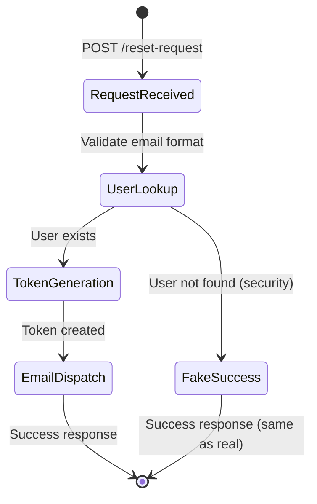

# Technical Specification Playbook

> **Purpose**: Guide the creation of precise technical specifications that translate architectural intent into implementation-ready guidance
> **Version**: 1.0
> **Last Updated**: 2024-12-31

---

## Mental Model

A technical specification is the bridge between "what the system should do" (PRD/FRD) and "how to build it" (code). It's precise enough that an engineer—or AI coding agent—can implement without ambiguity.

```
Architecture → Technical Spec → Implementation
     ↓              ↓                ↓
 "Structure"   "Precision"       "Code"

PRD: "Users can reset passwords"
FRD: "System sends email with reset link valid for 24 hours"
TechSpec: "POST /auth/reset → generates JWT with 24h expiry, sends via SendGrid template X"
```

**The Technical Spec Quality Ladder:**

| Level | State | Characteristics |
|-------|-------|-----------------|
| 0 | Wishful | "Handle password resets" — no specifics |
| 1 | Directional | Mentions technologies, still vague |
| 2 | Structured | Components identified, interfaces undefined |
| 3 | Specified | Data structures, APIs, algorithms described |
| 4 | Implementable | Engineer can code without questions |
| 5 | Testable | Every behavior has verification method |

**Target: Level 4-5 before handing to implementation.**

---

## Inputs / Outputs

### Inputs
- **Source Artifacts**: PRD, FRD, Reference Architecture
- **Technical Constraints**: Language, framework, infrastructure decisions
- **Non-Functional Requirements**: Performance, security, scale targets
- **Existing Systems**: Interfaces to integrate with
- **Domain Context**: Business rules, edge cases, exceptions

### Outputs
- **Technical Specification**: Complete, implementation-ready document
- **Interface Contracts**: API definitions, schemas, protocols
- **Data Models**: Entity definitions, relationships, validations
- **Algorithm Descriptions**: Logic flows, decision trees, state machines
- **Error Handling Spec**: Failure modes and responses

---

## Evaluation Dimensions

### Dimension 1: Scope Precision
The spec must define exactly what's being built—no more, no less. Ambiguous scope leads to scope creep or missing functionality.

**Probing Questions:**
- Can you state in one sentence what this component does?
- What's explicitly OUT of scope?
- Are there adjacent concerns that might creep in?
- Is this scope consistent with the source PRD/FRD?
- Would two engineers interpret this scope the same way?

**Red Flags:**
- Vague boundaries ("handle user data")
- Scope exceeds source requirements
- No explicit "out of scope" section

**Good Example:**
```
## Scope

**In Scope:**
- Password reset request endpoint (POST /auth/reset-request)
- Reset token generation and storage
- Reset email dispatch via SendGrid
- Password update endpoint (POST /auth/reset-confirm)
- Token validation and expiration

**Out of Scope:**
- Password strength validation (handled by existing validator)
- Account lockout logic (separate spec)
- Email template design (provided by design team)
```

**Bad Example:**
```
## Scope
Handle password reset functionality
```

---

### Dimension 2: Interface Contracts
Every boundary—APIs, functions, events, files—needs a defined contract. Consumers and producers must agree on the shape.

**Probing Questions:**
- What are all the entry points to this component?
- What's the exact request/response format for each endpoint?
- What are the function signatures with types?
- What events does this emit/consume?
- Are there file formats or protocols to specify?

**Red Flags:**
- Endpoints without request/response schemas
- Functions without type signatures
- Unspecified event payloads
- "JSON body" without schema

**Good Example:**
```
### POST /auth/reset-request

**Request:**
```json
{
  "email": "string (required, valid email format)"
}
```

**Response (200):**
```json
{
  "success": true,
  "message": "If an account exists, a reset email has been sent"
}
```

**Response (400):**
```json
{
  "error": "INVALID_EMAIL",
  "message": "Email format is invalid"
}
```

**Response (429):**
```json
{
  "error": "RATE_LIMITED",
  "message": "Too many requests. Try again in {retryAfter} seconds",
  "retryAfter": 60
}
```
```

**Bad Example:**
```
### POST /auth/reset-request
Accepts email, returns success or error
```

---

### Dimension 3: Data Structures
Every entity, model, and data shape must be fully defined. Ambiguous data structures cause integration failures.

**Probing Questions:**
- What entities/models does this component use?
- What are all the fields with types and constraints?
- What are the relationships between entities?
- Are there enums, constants, or lookup values to define?
- How does data flow through the component?

**Red Flags:**
- Entities without field definitions
- Missing types or constraints
- Undefined relationships
- Magic strings instead of enums

**Good Example:**
```
### PasswordResetToken Entity

| Field | Type | Constraints | Description |
|-------|------|-------------|-------------|
| id | UUID | PK, auto-generated | Token identifier |
| userId | UUID | FK → User.id, required | Associated user |
| tokenHash | string(64) | required, indexed | SHA-256 hash of token |
| expiresAt | DateTime | required | Token expiration (created + 24h) |
| usedAt | DateTime | nullable | When token was used (null if unused) |
| createdAt | DateTime | required, auto | Creation timestamp |

**Indexes:**
- `idx_reset_token_hash` on tokenHash (lookup)
- `idx_reset_token_user` on userId (cleanup queries)

**Constraints:**
- Token is single-use (usedAt must be null to use)
- Token expires 24 hours after creation
```

**Bad Example:**
```
### PasswordResetToken
Stores reset tokens with expiration
```

---

### Dimension 4: Behavioral Logic
Algorithms, business rules, and decision logic must be specified. "Smart" code needs explicit logic definition.

**Probing Questions:**
- What's the step-by-step algorithm for core operations?
- What decisions/branches exist in the logic?
- Are there state machines or workflows?
- What business rules govern behavior?
- Are there calculations or transformations to specify?

**Red Flags:**
- "The system determines..." (how?)
- Undocumented business rules
- Complex logic without pseudocode or flowchart
- Implicit state transitions

**Good Example:**
```
### Password Reset Flow



**Token Generation Algorithm:**
1. Generate 32 random bytes using crypto.randomBytes()
2. Encode as URL-safe base64 → this is the user-facing token
3. Hash with SHA-256 → this is stored in database
4. Create PasswordResetToken record with hash, userId, expiresAt = now + 24h
5. Return plaintext token for email (never stored)

**Security Invariant:** Response is identical whether user exists or not (prevents enumeration)
```

**Bad Example:**
```
### Password Reset Flow
Generate a token, send email, allow password update
```

---

### Dimension 5: Error Handling
Every failure mode needs a defined response. Unhandled errors cause production incidents.

**Probing Questions:**
- What can go wrong at each step?
- What's the response for each error type?
- Are errors recoverable or fatal?
- What gets logged vs. returned to user?
- Are there retry strategies?

**Red Flags:**
- No error cases documented
- Generic "500 Internal Error" for everything
- Sensitive info in error messages
- No distinction between client/server errors

**Good Example:**
```
### Error Handling

| Error | HTTP | Code | User Message | Log Level | Action |
|-------|------|------|--------------|-----------|--------|
| Invalid email format | 400 | INVALID_EMAIL | "Email format is invalid" | DEBUG | Return immediately |
| User not found | 200 | (none) | Same as success | INFO | Continue (security) |
| Token generation fails | 500 | INTERNAL_ERROR | "Please try again" | ERROR | Alert on-call |
| SendGrid unavailable | 500 | INTERNAL_ERROR | "Please try again" | ERROR | Retry 3x, then fail |
| Rate limited | 429 | RATE_LIMITED | "Too many requests" | WARN | Return retryAfter |
| Token expired | 400 | TOKEN_EXPIRED | "Reset link has expired" | DEBUG | Return |
| Token already used | 400 | TOKEN_USED | "Reset link already used" | WARN | Return |
| Password too weak | 400 | WEAK_PASSWORD | "Password doesn't meet requirements" | DEBUG | Return |

**Retry Strategy (SendGrid):**
- Retry up to 3 times with exponential backoff (1s, 2s, 4s)
- If all retries fail, return 500 and alert on-call
- Do NOT delete the token (allow manual retry)
```

**Bad Example:**
```
### Error Handling
Return appropriate errors
```

---

### Dimension 6: Testability
Every specified behavior should be verifiable. If you can't test it, you can't trust it.

**Probing Questions:**
- How do you test each endpoint/function?
- What's the test strategy (unit, integration, e2e)?
- Are there test cases for edge cases?
- What mocks/stubs are needed?
- What are the acceptance criteria?

**Red Flags:**
- No test strategy
- Behaviors that can't be tested in isolation
- Missing edge case tests
- No mocking strategy for external services

**Good Example:**
```
### Test Strategy

**Unit Tests:**
- Token generation produces valid format
- Token hash is deterministic
- Expiration calculated correctly
- Rate limiting logic works

**Integration Tests:**
- Full reset flow with test database
- SendGrid mock receives correct payload
- Token lookup and validation works
- Expired tokens rejected

**Edge Cases:**
| Case | Input | Expected |
|------|-------|----------|
| Non-existent user | valid email, no user | 200, no email sent |
| Already reset | valid token, already used | 400, TOKEN_USED |
| Expired token | valid token, past expiry | 400, TOKEN_EXPIRED |
| Malformed token | random string | 400, INVALID_TOKEN |
| Rate limited | 10 requests in 1 min | 429 on 11th |

**Mocking:**
- SendGrid: Mock API, verify template + params
- Database: Test database, truncate between tests
- Time: Mock Date.now() for expiration tests
```

**Bad Example:**
```
### Testing
Write tests for the functionality
```

---

### Dimension 7: Non-Functional Requirements
Performance, security, and operational constraints must be specified.

**Probing Questions:**
- What are the performance targets (latency, throughput)?
- What are the security requirements?
- What needs to be logged/monitored?
- What are the scaling constraints?
- Are there compliance requirements?

**Red Flags:**
- No performance targets
- Security not addressed
- No observability plan
- Undefined scaling behavior

**Good Example:**
```
### Non-Functional Requirements

**Performance:**
- Reset request: <200ms p95
- Token validation: <50ms p95
- Throughput: 100 requests/second sustained

**Security:**
- Tokens use cryptographically secure random generation
- Only token hash stored (plaintext never persisted)
- Rate limiting: 5 requests per email per hour
- Response identical for existing/non-existing users
- Reset tokens are single-use
- Logs must not contain email addresses (GDPR)

**Observability:**
- Metrics: reset_request_total, reset_complete_total, reset_failed_total
- Logs: Request ID, user ID (hashed), outcome, duration
- Alerts: >10 failures/min, SendGrid error rate >1%

**Scaling:**
- Stateless endpoint (horizontal scaling)
- Token table partitioned by createdAt (cleanup efficiency)
```

**Bad Example:**
```
### NFRs
Should be fast and secure
```

---

## Extended Question Bank

### Scope Refinement
1. What's the one-sentence description of this component?
2. What adjacent functionality should explicitly NOT be here?
3. If you cut 30% of scope, what goes?
4. What assumptions are you making about existing systems?
5. Is there overlap with other specs being written?

### Interface Design
6. List every endpoint/function this component exposes
7. What's the exact schema for each request and response?
8. What happens if a required field is missing?
9. What content types are accepted/returned?
10. Are there pagination, filtering, or sorting parameters?

### Data Modeling
11. What entities does this component own?
12. What entities does it reference but not own?
13. For each field: type, nullable?, default?, constraints?
14. What indexes are needed for query patterns?
15. What's the data lifecycle (creation → archival → deletion)?

### Logic Specification
16. Walk me through the happy path step by step
17. What decisions/branches exist? Draw them.
18. Are there any calculations? Show the formula.
19. What state transitions are possible?
20. What invariants must always be true?

### Error Design
21. What's every way this operation can fail?
22. For each failure: HTTP code, error code, user message?
23. What failures are retryable?
24. What gets logged (without leaking sensitive data)?
25. What failures should wake someone up at night?

### Test Planning
26. What's the minimum test coverage for confidence?
27. What's the hardest thing to test?
28. What external services need mocking?
29. What edge cases have bitten you before?
30. How do you test the failure paths?

---

## Common Pitfalls

| Pitfall | Symptom | Fix |
|---------|---------|-----|
| **Under-specified** | Implementer asks clarifying questions | Add detail until no questions remain |
| **Over-specified** | Spec prescribes implementation details unnecessarily | Specify WHAT, not HOW (unless algorithmic) |
| **Missing error cases** | Production failures not handled | Enumerate every failure mode |
| **Vague data models** | Integration failures, type mismatches | Full field-level specification |
| **No test strategy** | Untestable implementation | Define test approach upfront |
| **Implicit dependencies** | Runtime failures | Explicit interface contracts |
| **Security afterthought** | Vulnerabilities in production | Security as first-class dimension |
| **Copy-paste spec** | Inconsistencies between sections | Review for coherence |
| **Premature optimization** | Over-engineered solution | Start simple, specify scaling path |
| **Missing NFRs** | Slow, unmonitorable, insecure | Explicit non-functional section |

---

## Technical Spec Template

```markdown
# Technical Specification: [Component Name]

> **Source**: [Link to PRD/FRD]
> **Owner**: [Name]
> **Version**: [X.X]
> **Status**: [Draft | Review | Approved | Implemented]
> **Last Updated**: [YYYY-MM-DD]

---

## Overview

[2-3 sentences: what this component does and why it exists]

---

## Scope

### In Scope
- [Capability 1]
- [Capability 2]

### Out of Scope
- [Explicit exclusion 1]
- [Explicit exclusion 2]

### Dependencies
- [System/service this depends on]
- [Data source this reads from]

---

## Interface Contracts

### [Endpoint/Function 1]

**Signature:** `POST /api/v1/resource`

**Request:**
```json
{
  "field1": "type (required|optional) - description",
  "field2": "type (required|optional) - description"
}
```

**Response (200):**
```json
{
  "field": "type - description"
}
```

**Errors:**
| Code | HTTP | Message |
|------|------|---------|
| ERROR_CODE | 4XX | User-facing message |

---

## Data Structures

### [Entity Name]

| Field | Type | Constraints | Description |
|-------|------|-------------|-------------|
| field | type | constraints | description |

**Relationships:**
- [Relationship description]

**Indexes:**
- [Index definition]

---

## Behavioral Logic

### [Process Name]

[Algorithm description, state diagram, or pseudocode]

```mermaid
[Diagram if helpful]
```

**Business Rules:**
1. [Rule 1]
2. [Rule 2]

---

## Error Handling

| Error | HTTP | Code | Message | Log | Action |
|-------|------|------|---------|-----|--------|
| [Error] | [Code] | [CODE] | [Message] | [Level] | [Action] |

**Retry Strategy:**
[If applicable]

---

## Non-Functional Requirements

### Performance
- [Target 1]

### Security
- [Requirement 1]

### Observability
- Metrics: [metric names]
- Logs: [what's logged]
- Alerts: [conditions]

---

## Test Strategy

### Unit Tests
- [What's unit tested]

### Integration Tests
- [What's integration tested]

### Edge Cases
| Case | Input | Expected |
|------|-------|----------|
| [Case] | [Input] | [Output] |

---

## Open Questions

- [ ] [Question still to resolve]

---

## Changelog

| Version | Date | Author | Changes |
|---------|------|--------|---------|
| X.X | YYYY-MM-DD | [Name] | [Changes] |
```

---

## Invariants

1. **Every interface MUST have a complete contract** — request schema, response schema, error cases
2. **Every entity MUST have field-level specification** — type, constraints, nullability
3. **Behavioral logic MUST be explicit** — no "the system determines" without specifying how
4. **Error handling MUST be exhaustive** — every failure mode documented
5. **Security MUST be addressed explicitly** — not implicit or "obvious"
6. **Test strategy MUST exist before implementation** — if you can't test it, don't build it
7. **NFRs MUST have measurable targets** — "fast" is not a requirement, "<200ms p95" is
8. **Scope MUST have explicit exclusions** — what's NOT included is as important as what is

---

## Integration with Melissa's Workflow

Technical specs typically follow this lineage:

```
PRD → FRD → Reference Architecture → Technical Spec → Implementation Plan
                                          ↑
                                     (You are here)
```

**Handoff from Architecture:**
- Component responsibilities defined
- Integration patterns established
- Technology choices made

**Handoff to Implementation:**
- All interfaces specified
- Data models complete
- Algorithms documented
- Ready for task decomposition

---

## Version History

| Version | Date | Changes |
|---------|------|---------|
| 1.0 | 2024-12-31 | Initial playbook: 7 dimensions, 30-question bank, template, invariants |

---

*Solutions Architect — Translating architecture into implementation-ready precision.*
